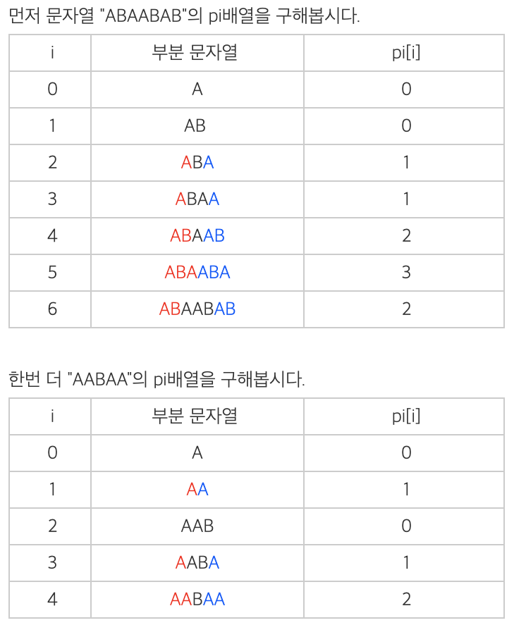
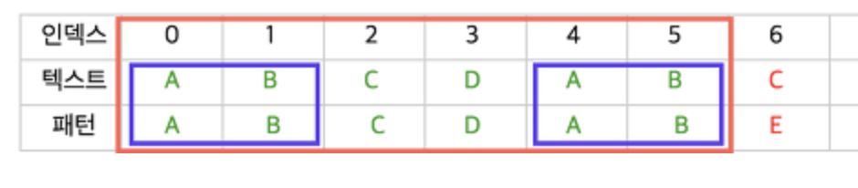

## KMP

> 시간 복잡도 O(N+M)


### 알아야 할 것

- 접두사와 접미사

  - <banana 접두사>

    ```
    b
    ba
    ban
    bana
    banan
    banana
    ```

    총 6개의 접두사

  - <banana의 접미사>

    ```
    a
    na
    ana
    nana
    anana
    banana
    ```

    총 6개의 접미사

- pi 배열

  - 주어진 문자여의 0~i까지의 부분 문자열 중에 **접두사 = 접미사**가 될 수 있는 부분 중 가장 긴것의 길이(접두사가 0~i 까지의 부분 문자열과 같으면 안된다.)

  


### 방법

텍스트 ABCDABCDABEE 에서 ABCDABE 를 찾을 때

| index  | 0    | 1    | 2    | 3    | 4    | 5    | 6    | 7    | 8    | 9    | 10   | 11   |
| :----: | ---- | ---- | ---- | ---- | ---- | ---- | ---- | ---- | ---- | ---- | ---- | ---- |
| 텍스트 | A    | B    | C    | D    | A    | B    | C    | D    | A    | B    | E    | E    |
|  패턴  | A    | B    | C    | D    | A    | B    | E    |      |      |      |      |      |

- 0 ~ 5 까지는 동일함 하지만 6이 다름
- 일치 했다는 사실을 이용!

- 접두사 AB 와 접미사 AB가 같다는 점을 이용한다

  

| Index  | 0    | 1    | 2    | 3    | 4    | 5    | 6    | 7    | 8    | 9    | 10   | 11   |
| ------ | ---- | ---- | ---- | ---- | ---- | ---- | ---- | ---- | ---- | ---- | ---- | ---- |
| 텍스트 | A    | B    | C    | D    | A    | B    | C    | D    | A    | B    | E    | E    |
| 패턴   |      |      |      |      | A    | B    | C    | D    | A    | B    | E    | E    |

