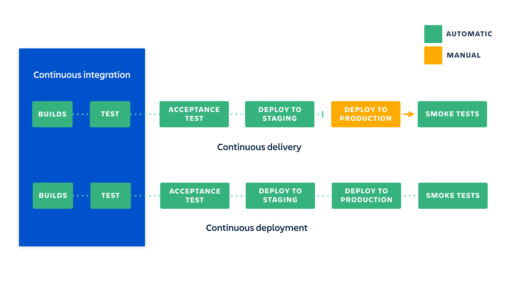

## CI / CD란?

애플리케이션 개발 단계를 자동화 하여 짧은 주기로 배포하는 방법

### CI (Continuous Integration)

개발자를 위한 자동화 프로세스 

코드 변경 사항이 정기적으노 **빌드 및 테스트**되어 공유 리포지토리에 통합되어 여러 명의 개발자가 동시에 애플리케이션 개발과 관련된 코드 작업을 할 경우 충돌할 수 있는 문제를 해결할 수 있도록 한다

**필요한 것**

- 각각의 새로운 기능, 개선 또는 버그 수정에 대한 자동 테스트를 작성해야함
- 테스트를 자동으로 실행할 지속적인 통합 서버가 필요

**장점**

- 테스트ㅁ를 통해 버그 감소
- 문제를 조기에 해결하므로 릴리스를 쉽게 구축
- 테스트 비용 절감

### CD (Continuous Delivery/Deployment)

지속적인 전달/배포 

짧은 주기로 개발중인 소프트웨어를 **배포**하고 그 과정을 자동화할 수 있도록 한다

Delivery vs Deployment

- Delivery - 프로덕션을 수동으로 배포
- Deployment - 프로덕션을 자동으로 배포

#### Delivery

**필요한 것**

- 배포를 자동화 해야한다
- 불완전한 기능이 프로덕션 고객에게 영향을 미치지 않도록 해야한다

**장점**

- 배포의 복잡성이 사라짐
- 자주 릴리스 하여 고객으로부터 피드백 루프를 가속화 할 수 있다

#### Deployment

**필요한 것**

- 테스트  스위트의 품질에 따라 릴리스의 품질이 결정된다
- 문서화 프로세스가 배포 속도에 맞춰야한다

**장점**

- 릴리스 개발을 일시 중지 할 필요가 없으므로 더 빠르게 개발이 가능함
- 작은 배치 변경 사항을 배포할 때 문제가 발생할 경우 릴리스가 덜 위험하므로 수정하기가 더 쉬움

배포과정

1. 기존에 동작하던 애플리케이션을 종료후 빌드 파일로 애플리케이션 구동
2. 무중단 배포시, 새로 업데이트된 파일을 다른 포트에 풀어놓고, 구동이 완료되면 프락시에서 들어오는 요청을 스위칭 함(reverse proxy)

### 출처

https://www.atlassian.com/continuous-delivery/principles/continuous-integration-vs-delivery-vs-deployment

https://jhleed.tistory.com/130

