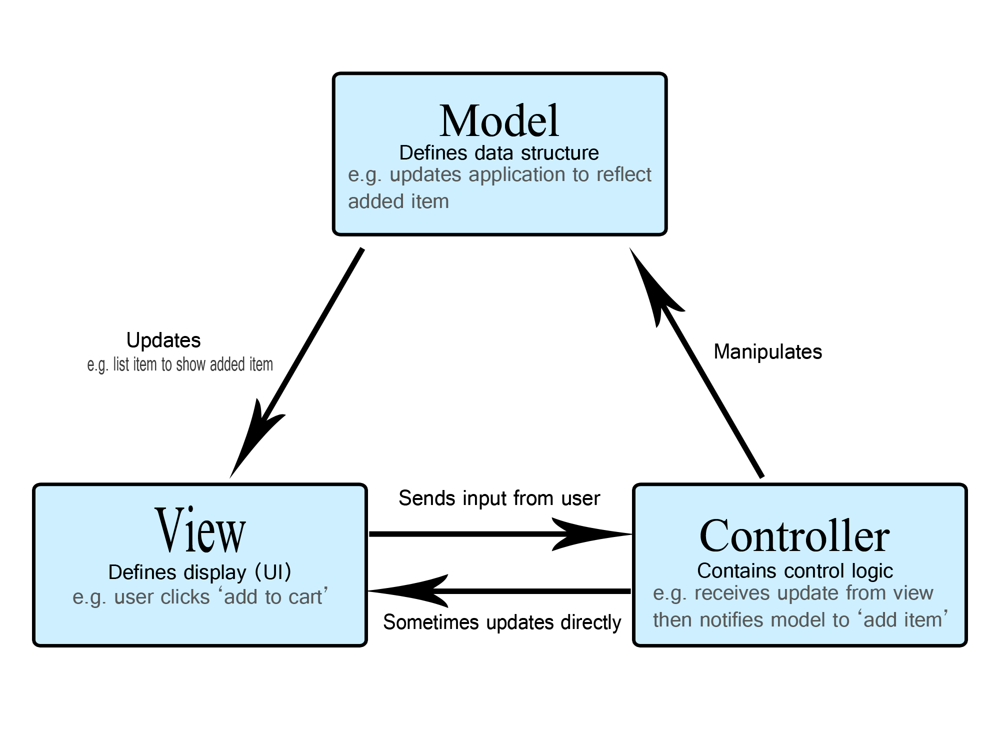

## MVC 

> Model, View, Controller 의 약자
>
> 애플리케이션, 프로젝트를 구성할 때 그 구성요소를 세가지의 역할로 구분

- **Model** - 객체나 데이터를 가지고 있는 JAVA POJO, 데이터가 변하면 Controller의 데이터를 업데이터 하는 로직이 포함된다.

  > *Model represents an object or JAVA POJO carrying data. It can also have logic to update controller if its data changes.*

- **View** - 모델이 포함하는 데이터를 시각화하는 것

  > View represents the visualization of the data that model contains.

- **Controller** - model과 view 두 곳데 연향을 미친다. 모델 객체로의 데이터 흐름을 제어하고 데이터가 변경 되었을 때 뷰를 갱신한다. Controller는 View와 Model의 역할을 분리

  > *Controller acts on both model and view. It controls the data flow into model object and updates the view whenever data changes. It keeps view and model separate.*

### 장단점

- 장점 
  - 다수의 개발자들이 함께 개발을 할 수 있다
  - MVC는 컨트롤러에서 관련 작업을 논리적으로 그룹화 할 수 있다. 특정 모델에 대한 뷰도 또한 함께 그룹화된다
  - 모델은 여러 뷰를 가질 수 있다
  - 유연하고 확장하기 쉽다, 유지보수 비용을 절감할 수 있다
- 단점
  - 프레임 워크는 새로운 추상화 계층을 도입하고 사용자가 MVC에 적응해야하기 때문에 복잡할 수 있다
  - 여러 기술의 지식의 표준이 되다보니 MVC 를 사용하는 개발자는 다수의 기술에 능숙해야한다
  - Model과 View의 완벽한 분리가 어렵다