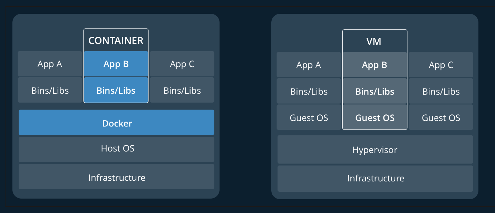

## Docker Tutorial

### Docker 란?

> Docker is a platform for developers and sysadmins to **build, run, and share** applications with containers. The use of containers to deploy applications is called *containerization*. Containers are not new, but their use for easily deploying applications is.
>
> Docker는 개발자와 시스템 관리자가 컨테이너와 응용 프로그램을 빌드, 실행 및 공유 할 수있는 플랫폼입니다. 컨테이너를 사용하여 응용 프로그램을 배포하는 것을 'containerization'라고합니다. 컨테이너는 새로운 것이 아니지만 응용 프로그램을 쉽게 배포하는 데 사용됩니다.


#### Containerization가 인기있는 이유

- **Flexible**
  - 가장 복잡한 응용 프로그램도 컨테이너화 할 수 있습니다
- **Lightweight**
  - 컨테이너는 호스트 커널을 활용하고 공유하므로 가상 시스템보다 시스템 리소스 측면에서 훨씬 효율적입니다.
- **Portable**
  - 로컬로 구축하고 클라우드에 배포하며 어디에서나 실행할 수 있습니다.
- **Loosely coupled**
  - 컨테이너는 자체적으로 충분하고 캡슐화되어 있으므로 다른 컨테이너를 방해하지 않고 교체하거나 업그레이드 할 수 있습니다.
- **Scalable**
  - 데이터 센터에 컨테이너 복제본을 늘리고 자동으로 배포 할 수 있습니다.
- **Secure**
  - 컨테이너는 사용자가 구성 할 필요없이 공격적인 제약 조건과 격리를 프로세스에 적용합니다


#### Images와 Container

기본적으로 컨테이너는 실행중인 프로세스 일 뿐이며 호스트 및 다른 컨테이너와 격리하기 위해 캡슐화 기능이 추가되어 있습니다. 컨테이너 격리의 가장 중요한 측면 중 하나는 각 컨테이너가 자체 개인 파일 시스템과 상호 작용한다는 것입니다. 이 파일 시스템은 Docker 이미지에 의해 제공됩니다. 이미지에는 응용 프로그램을 실행하는 데 필요한 모든 것 (코드 또는 이진, 런타임, 종속성 및 기타 필요한 파일 시스템 개체)이 포함됩니다.


#### Containers and virtual machines

컨테이너는 Linux에서 기본적으로 실행되며 호스트 시스템의 커널을 다른 컨테이너와 공유합니다. 별도의 프로세스를 실행하여 다른 실행 파일보다 더 많은 메모리를 사용하지 않아 경량화됩니다.

반대로 가상 머신 (VM)은 하이퍼 바이저를 통해 호스트 리소스에 가상으로 액세스 할 수있는 완전한 "게스트"운영 체제를 실행합니다. 일반적으로 VM은 애플리케이션 로직에서 소비하는 것보다 많은 오버 헤드를 발생시킵니다.




#### 실행 방법

1. ```dockerfile
   docker run hello-world
   ```

   hello-world 도커 이미지 생성

2. ```dockerfile
   docker image ls
   ```

   다운로드한 이미지 리스트 보기

3. ```dockerfile
   docker container ls --all
   ```

   도커 컨테이너 모두 보기


#### 실습

1. ```
   git clone https://github.com/dockersamples/node-bulletin-board
   ```

2. Dockerfile 컨테니너 정의하기

   ```
   # Use the official image as a parent image
   FROM node:current-slim
   
   # Set the working directory
   WORKDIR /usr/src/app
   
   # Copy the file from your host to your current location
   COPY package.json .
   
   # Run the command inside your image filesystem
   RUN npm install
   
   # Inform Docker that the container is listening on the specified port at runtime.
   EXPOSE 8080
   
   # Run the specified command within the container.
   CMD [ "npm", "start" ]
   
   # Copy the rest of your app's source code from your host to your image filesystem.
   COPY . .
   ```

   - Start `FROM` the pre-existing `node:current-slim` image. This is an *official image*, built by the node.js vendors and validated by Docker to be a high-quality image containing the Node.js Long Term Support (LTS) interpreter and basic dependencies.
   - Use `WORKDIR` to specify that all subsequent actions should be taken from the directory `/usr/src/app` *in your image filesystem* (never the host’s filesystem).
   - `COPY` the file `package.json` from your host to the present location (`.`) in your image (so in this case, to `/usr/src/app/package.json`)
   - `RUN` the command `npm install` inside your image filesystem (which will read `package.json` to determine your app’s node dependencies, and install them)
   - `COPY` in the rest of your app’s source code from your host to your image filesystem

   > dockerfile reference : https://docs.docker.com/engine/reference/builder/

3. build

   ```
   docker image build -t bulletinboard:1.0 .
   ```

4. run

   ```
   docker container run --publish 8000:8080 --detach --name bb bulletinboard:1.0
   ```

   bb 이름으로 컨테이너 시작

   - `--publish` asks Docker to forward traffic incoming on the host’s port 8000, to the container’s port 8080. Containers have their own private set of ports, so if you want to reach one from the network, you have to forward traffic to it in this way. Otherwise, firewall rules will prevent all network traffic from reaching your container, as a default security posture.
   - `--detach` asks Docker to run this container in the background.
   - `--name` specifies a name with which you can refer to your container in subsequent commands, in this case `bb`.

5. localhost:8000 접속

6. 삭제

   ```
   docker container rm --force bb
   ```

   