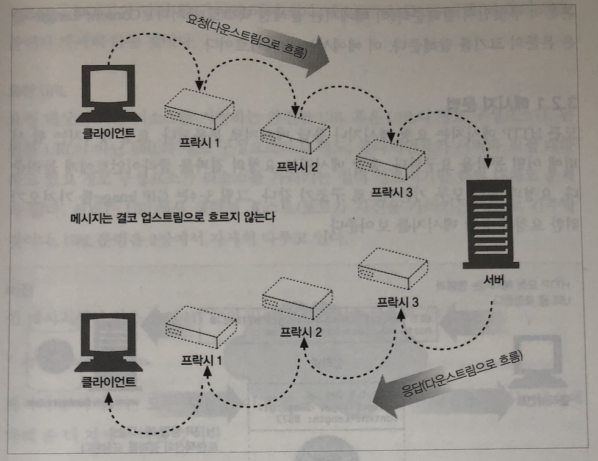

## HTTP 메시지

#### 메시지 방향

- 인바운드 : 메시지가 서버로 향하는 것

- 아웃바운드 : 모든 처리가 끝난 뒤 메시지가 사용자 에이전트로 돌아오는 것

- 다운스트림 : 모든 메시지는 다운스트림 (어디로 향하는 냐가 아닌 발송자와 수신자에 대한것)

  

  

#### 메시지 부분

- 시작줄
- 헤더 블록
- 본문

으로 구성됨.

**요청 메시지**

```
<메서드> <요청 URL> <버전>
<헤더>

<엔터티 본문>
```

**응답 메시지**

```
<버전> <상태 코드> <사유 구절>
<헤더>

<엔터티 본문>
```


#### 시작줄

- 요청줄 : 서버에서 어떤 동작이 일어나야 하는지 설명하는 메서드와 그 동작을 지칭하는 URL + 버전으로 구성
  - 메서드 : GET, POST, ...
  - 요청 URL : URL의 경로 구성 ( 리소스를 가르키는 경로 )
  - 버전 : HTTP/<메이저>.<마이너> - 애플리케이션이 지원하는 가장 높은 HTTP 버전
- 응답줄 : 수행 결과에 대한 상태 정보와 결과 데이터를 클라이언트에게 전송
  - 상태 코드 : 세자리 숫자, 성공이나 에러를 나타냄
    - 100-199 : 정보
    - 200-299 : 성공
    - 300-399 : 리다이렉션
    - 400-499 : 클라이언트 에러
    - 500-599 : 서버 에러
  - 사유 구절 : OK, NOT OK ...


#### 헤더

 **Name : Value (CRLF), 각 헤더는 반드시 CRLF 로 끝나야 한다**

- 일반 헤더 : 요청과 응답 양쪽에 모두 나타남
- 요청 헤더 : 요청에 대한 부가 정보
- 응답 헤더 : 응답에 대한 부가 정보
- Entity 헤더 : 본문 크기와 콘텐츠, 리소스 자체를 서술
- 확장 헤더 : 명세에 정의되지 않은 새로운 헤더


**엔터디 본문**

메시지의 화물 

- 이미지, 비디오 등 데이터가 담기는 곳


#### 메서드

- GET (Select)
  - 서버에서 어떤 문서를 가져온다 (Body를 가질 수 없다.)
- POST(Insert)
  - 서버가 처리해야 할 데이터를 보낸다
- PUT(Update)
  - 서버에 요청 메시지의 본문을 저장한다.
- DELETE(Delete)
  - 서버에서 문서를 제거한다. (Body를 가질 수 없다.)
- HEAD
  - 응답으로 헤더만 덜려준다. 엔터티 본문은 반환하지 않는다.
    - 리소스를 가져오지 않고도 무엇인지 알아낼 수 있다.
    - 개체가 존재하는지 확인할 수 있음
    - 리소스가 변경되었는지 검사
- 그 외 TRACE, OPTIONS, extension-Method


#### 상태코드

- 100 - 199 : 정보성 상태 코드
  - 100 contiue
    - 요청 시작 부분을 일부가 받아 들어졌으며, 클라이언트는 나머지를 계속 이어서 보내야 함
  - 101 Switching Protocols
    - 클라이언트가 Upgrade 헤더에 나열한 것중 하나로 서버가 프로토콜을 바꾸었음을 의미
- 200 - 299 : 성공 관련 상태 정보
  - 200 : OK
  - 201 : created
  - 202 : Accepted
  - 203 : Non-Authoritative Information
  - 204 : No content
  - 205 : Reset Content
  - 206 : Partial Content
- 300 -399 : 리다이렉션 관련 상태 정보
  - 300 : Multiple choices
  - 301 : Moved Permanently
  - 302 : Found
  - 303 : See other
  - 304 : Not Modified
  - 305 : User Proxy
  - 307 : Temporary Redirect
- 400 - 499 : 클라이언트 에러 관련 상태 정보
  - 400 : Bad Request
  - 401 : Unauthorized
  - 403 : forbidden
  - 404 : Not Found
  - 408 : Request Timeout
  - 415 : Unsupported Media Type
- 500 - 599 : 서버 에러 관련 상태 정보
  - 500 : Internal Server error
  - 501 : Not Implemented
  - 502 : Bad Gateway
  - 503 : Service unavailable
  - 504 : Gateway Timeout
  - 505 : HTTP version not supported


#### 헤더

- 일반헤더 : 클라이언 서버 양쪽 모두 사용
  - 기본적인 정보를 제공
    - Connection
    - Date
    - MIME-Version
    - Trailer chunked transfer
    - Transfer-Encoding
    - Upgrade
    - Via
  - 일반 caches header
    - 서버로 부터 로컬 복사본으로 캐시 할 수 있도록 해주는 header
- 요청 헤더 : 요청 메시지에만 의미를 갖는 헤더
  - Client-IP, From, Host ...
  - Accept 관련 헤더
    - 클라이언트가 무엇을 원하는지 혹은 원치 않은 것이 무엇인지 알려 줄수 잇음
    - Accept, Accepted-charset...
  - 조건부 요청 헤더
    - 요청에 대한 제약
    - 특정 문서를 요청 할 때 자신이 가지고 있는 사본과 다를 경우 전해달라고 요청 할 수 있음
    - Expect, If-Match, If-Modified-Since...
  - 요청 보안헤더
    - 요청을 위한 간단 인증요구/응답 체계를 가지고 있음
    - 리소스에 접근하기 전에 자신을 인증함으로 트랜잭션을 더 안전하기 만들기 위해서
  - 프락시 요청 헤더
    - Proxy를 돕기 위한 헤더
- 응답 헤더 : 응답 메시지에만 의미를 갖는 헤더
  - Age, Public, Server...
  - 협상 헤더
    - 서버와 클라이언트가 어떤 표현을 택할 것인지 협상을 위한
  - 응답 보안 해더
    - HTTP 인증 요구/응답 체계에서 응답 측에 해당
- 엔터티 헤더
  - 요청과 응답 모두 Entity Header를 가짐
    - Allow : 수행 될 수 있는 요청 나열
    - Location : 클라이언트에게 엔터티가 어디에 위치하는지 또는 새로운 위치를 알려줄 때
  - 콘텐츠 헤더
    - 엔터티의 콘텐츠에 대한 구체적인 정보 제공
  - 엔터티 캐싱 헤더
    - 엔티티 캐싱에 대한 정보 제공
    - 리소스에 대해 캐시된 사본이 아직 유효한지 에대한 정보