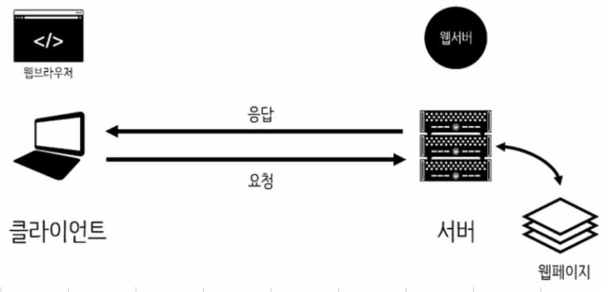
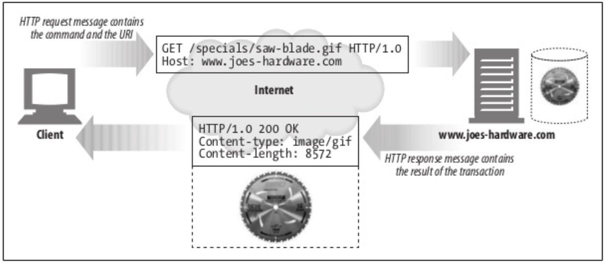
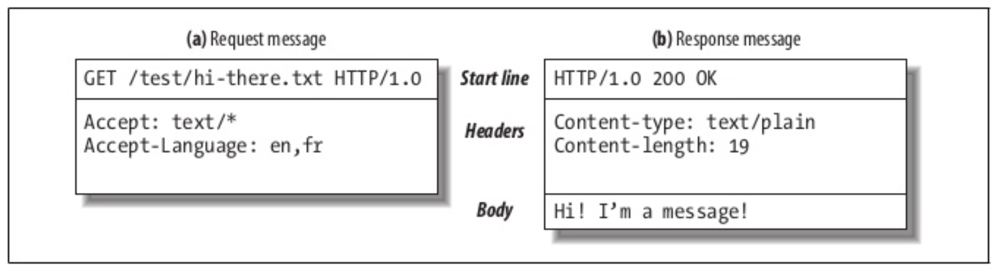

## HTTP Intro

#### 웹 클라이언트와 서버

#### 리소스

텍스트 파일, HTML 파일, 마이크로소프트 워드 파일, Jpg...

#### 미디어 타입

= MIME 타입(Multipurpose Internet Mail Extensions)

- HTTP 객체 데이터에 MIME 타입이 붙음
- 다룰 수 있는 객체인지 판단하기 위함
- text/html, text/plain, image/jpeg ...

#### URI

Uniform resources identifier 

정보 리소스를 식별하고 위치를 지정하는 것

Ex) https://www.joes-hardware.com/specials/saw-blade.gif

#### URL

- Scheme : 리소스에 접근하기 위해 사용되는 프로토콜 서술
- 인터넷 주소
- 웹 서버의 리소스

#### 트랜잭션

- 요청 명령과 응답 결과로 구성

#### HTTP 메서드

| HTTP 메서드 | 설명                                                        |
| ----------- | ----------------------------------------------------------- |
| GET         | 서버에서 클라이언트로 지정한 리소스를 보내라                |
| POST        | 클라이언트 데이터를 서버 게이트웨이 애플리케이션으로 보내라 |
| PUT         | 지정한 이름의 리소스를 저장하라                             |
| DELETE      | 지정한 리소스를 삭제하라                                    |
| HEAD        | 지정한 리소스에 대한 응답에서, HTTP 헤더 부분만 보내라      |

#### HTTP 상태코드

| HTTP 상태코드 | 설명                                       |
| ------------- | ------------------------------------------ |
| 200           | 좋다                                       |
| 302           | 다시 보내라. 다른 곳에서 리소스를 가져가라 |
| 404           | 없음. 리소스를 찾을 수 없음                |

등등

#### 메시지 

- 시작줄
- 헤더
- 본문

#### TCP 커넥션

**TCP/IP**

HTTP는 애플리케이션 계층으로 TCP/IP에게 맡긴다

TCP가 제공하는 기능

- 오류 없는 데이터 전송
- 순서에 맞는 전달
- 조각나지 않는 데이터 스트림

HTTP를 통해 데이터를 전송하기 이전에 TCP 연결이 이루져야함.

-> TCP 연결을 이루기 위해서 주소와 포트 번호를 어떻게 알까? => 웹은 기본적으로 80포트를 사용하고 DNS를 통하여 IP 주소를 얻을 수 있다.

1. 브라우저 URL에서 호스트 명 추출
2. 호스트 명을 IP로 변환
3. 포트번호가 있으면 추출
4. 웹서버와 TCP 연결
5. HTTP 요청 응답

#### 프로토콜 버전

- HTTP/0.9 : 구식 Get만 지원
- HTTP/1.0 : 널리 쓰이기 시작했지만 잘 정의되지 않은 명세
- HTTP/1.0+ : Keep alive 커넥션, 프락시 등 확장된 버전
- HTTP/1.1 : 구조절 결함 교정, 최적화 
- HTTP/2.0

#### 웹 구성요소

- 프락시 : 클라이언트와 서버 사이의 HTTP 중개자
- 캐시 : 웹페이지를 클라이언트 가까이에 보관하는 HTTP 창고
- 게이트웨이 : 다른 애플리케이션과 연결된 특별한 웹 서버
  - HTTP 요청을 받고 FTP로 변환
- 터널 : 단순히 HTTP 통신을 전달하기만 하는 특별한 프락시
  - ex) SSL 
- 에이전트 : 자동화된 HTTP 요청을 만드는 웹클라이언트