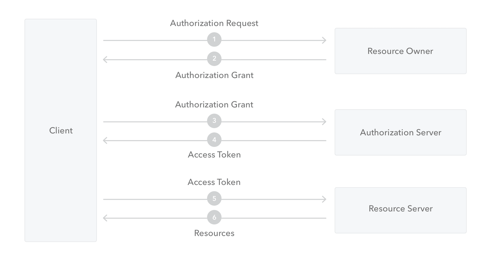
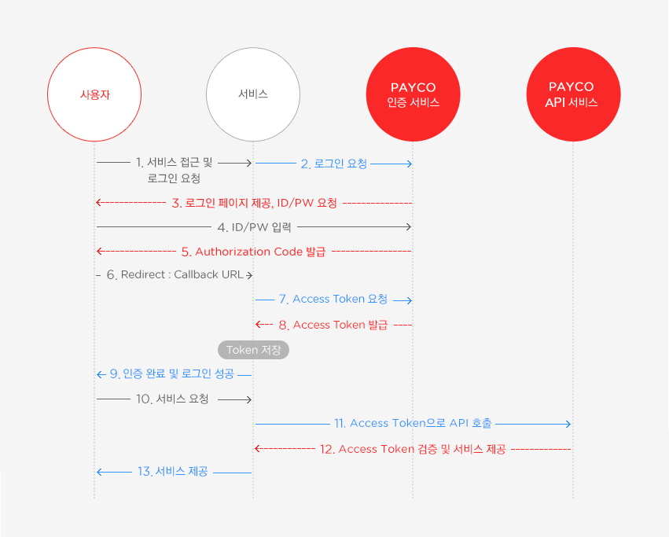

## OAuth2

> https://meetup.toast.com/posts/105
>
> https://cheese10yun.github.io/oauth2/
>
> https://auth0.com/docs/protocols/oauth2

OAuth 2.0은 다양한 플랫폼 환경에서 권한 부여를 위한 산업 표준 프로토콜


### OAuth roles

```
사용자 : Resource Owner
ex) 일반 사용자
```

```
클라이언트 : Client
ex) 구글, 페이스북 아이디로 로그인이 가능한 서비스. 제 3의 서비스.
```

```
API 서버 : Resource Server
ex) 이름, 나이 등 아이디 관련 정보를 제공하는 서버. 구글, 페이스북 등.
```

```
권한 부여 서버 : Authorization Server
ex) 로그인을 통해 인증 후 권한을 부여하는 서버. 구글, 페이스북 등.
```

```
인증 서버 : Authentication Server
ex) 실제로 로그인 서비스를 제공하는 서버. 구글, 페이스북 등
```



1. 클라이언트가 자원을 얻기 위해서 Resource Owner로 부터 authorization을 요청 한다
2. Resource Owner는 이 접속을 수락하고 Client에게 **Authorization Grant**(권한을 나타내는 증명서)를 준다
3. 클라이언트는 Authorization Server에게 Authorization Grant를 주면서 **Access Token**을 요구한다
4. Authorization Grant가 유효하면 클라이언트에게 Access Token을 준다
5. 클라리언트는 Resource를 얻기 위해서 Access Token을 가지고 Resource Server에게 요청한다
6. Access Token이 유효하다면 클라이언트의 요청을 들어준다


### OAuth2.0 인증 방식

- Authorization Code Grand Type : 권한 부여 코드 승인 타입 
  - used by Web Apps executing on a server
  - PKCE 기술 - https://auth0.com/docs/flows/concepts/auth-code-pkce
- Implicit Grant Type : 암시적 승인
  - used by JavaScript-centric apps (Single-Page Applications) executing on the user's browser.
- Resource Owner Password Credentials Grant Type : 리소스 소유자 암호 자격 증명 타입
  - used by trusted apps.
- Client Credentials Grant Type : 클라이언트 자격 증명 타입
  - used for machine-to-machine communication.

#### Authorization Code Grand Type

인증 과정


<출처 : 페이코>


프로세스



<출처 : 페이코>

|      | 회사 방문 과정                                               | OAuth 인증 과정                        |
| ---- | ------------------------------------------------------------ | -------------------------------------- |
| 1.   | 나방문씨가 안내 데스크에서 업무적인 목적으로 김목적씨를 만나러 왔다고 말한다. | Request Token의 요청과 발급            |
| 2.   | 안내 데스크에서는 김목적씨에게 나방문씨가 방문했다고 연락한다. | 사용자 인증 페이지 호출                |
| 3.   | 김목적씨가 안내 데스크로 찾아와 나방문씨의 신원을 확인해 준다. | 사용자 로그인 완료                     |
| 4.   | 김목적씨는 업무 목적과 인적 사항을 안내 데스크에서 기록한다. | 사용자의 권한 요청 및 수락             |
| 5.   | 안내 데스크에서 나방문 씨에게 방문증을 발급해 준다.          | Access Token 발급                      |
| 6.   | 김목적씨와 나방문씨는 정해진 장소로 이동해 업무를 진행한다.  | Access Token을 이용해 서비스 정보 요청 |

