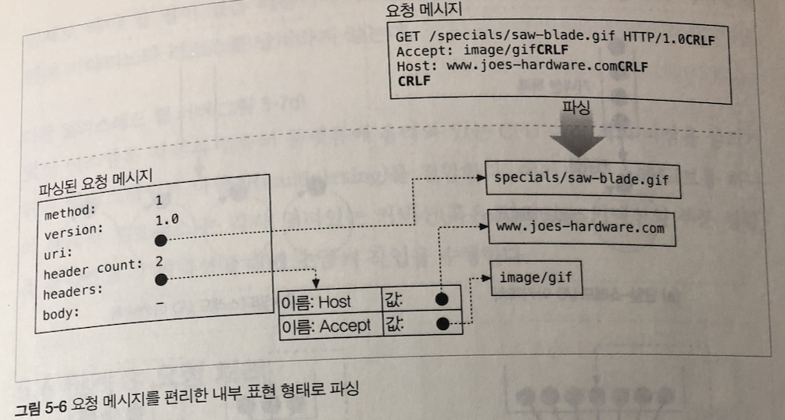
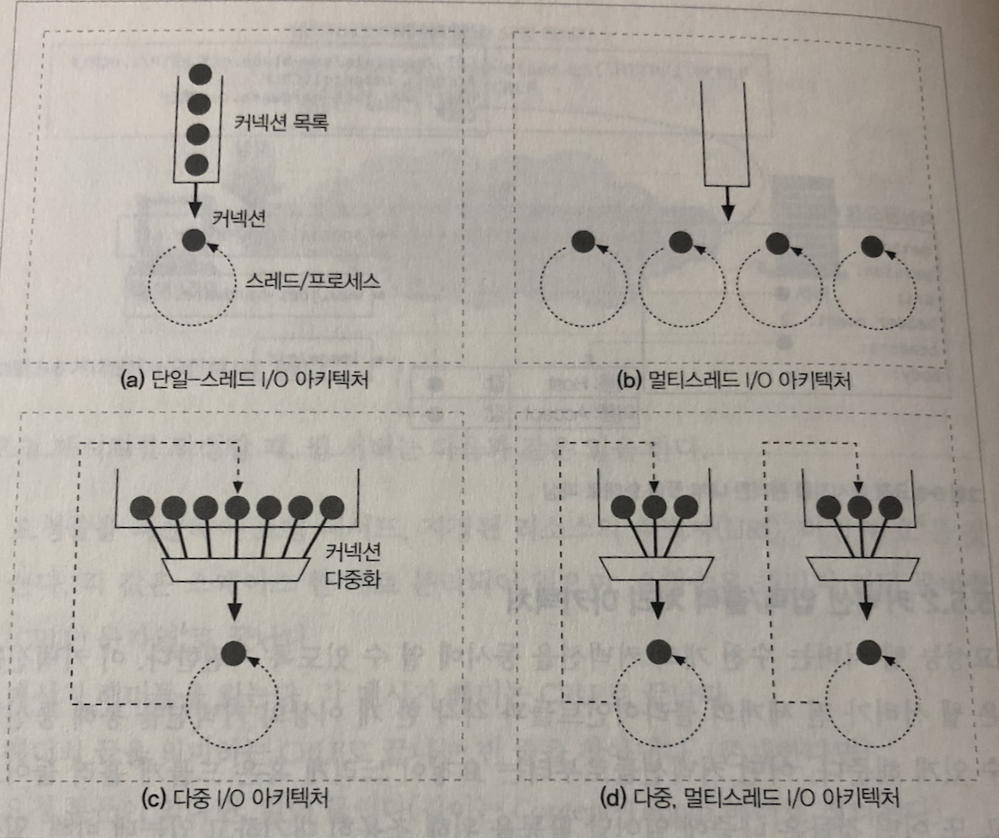

## 웹 서버

### 웹 서버가 하는 일

1. 커넥션을 맺는다 - 클라이언트의 접속을 받아들이거나, 원치 않는 클라이언트라면 닫는다.
2. 요청을 받는다 - HTTP요청 메시지를 네트워크로부터 읽어 들인다
3. 요청을 처리한다 - 요청 메시지를 해석하고 행동을 취한다
4. 리소스에 접근한다 - 메시지에서 지정한 리소스에 접근한다
5. 응답을 만든다 - 올바른 헤더를 포함한 HTTP 응답 메시지를 생성한다
6. 응답을 보낸다 - 응답을 클라이언트에게 돌려준다
7. 트랜잭션을 로그로 남긴다 - 로그파일에 트랜잭션 완료에 대한 기록을 남긴다

#### 단계 1 ; 클라이언트 커넥션 수락

클라이언트가 이미 서버에 대해 열려있는 지속적 커넥션을 갖고 있다면, 클라이언트는 요청을 보내기 위해 그 커넥션을 사용할 수 있다.

- 새 커넥션 다루기
  - 클라이언트가 웹서버에 TCP 커넥션을 요청하면, 웹 서버는 그 커넥션을 맺고 TCP 커넥션에서 IP 주소를 추출하여 어떤 클라이언트가 있는지 확인한다.
  - 새 커넥션이 맺어지고 받아들여면, 서버는 새 커넥션을 커넥션 목록에 추가하고 커넥션에서 오가는 데이터를 지켜보기 위한 준비를 한다.
  - 웹 서버는 어떤 커넥션이든 마음대로 거절하거나 즉시 닫을 수 있다.
- 클라이언트 호스트 명 식별
  - 웹 서버는 **역방향 DNS**를 이용해서 클라이언트의 IP주소를 호스트명으로 변환한다. (접근 제어와 로깅을 위해 사용)
  - 호스트명 룩업은 시간이 많이 걸림 -> 대용량 서버는 꺼두거나 특정 콘텐츠에서만 사용
- ident를 통해 클라이언트 사용자 알아내기
  - Ident 프로토콜은 서버에게 어떤 사용자 이름이 HTTP 커넥션을 초기화 했는지 찾아낼 수 있게 한다.

#### 단계 2 : 요청 메시지 수신

커넥션에 데이터가 도착하면, 웹 서버는 네트워크 커넥션에서 그 데이터를 읽어 들이고 파싱하여 요청 메시지를 구성한다.

- 요청줄을 파싱하여 요청 메서드, 지정된 리소스의 식별자(URI), 버전 번호를 찾는다.
- 메시지 헤더들을 읽는다
- 헤더의 끝을 의미하는 CRLF로 끝나는 빈 줄을 찾아낸다
- 요청 본문이 있다면, 읽어들인다.

커넥션 입력/출력 처리 아키텍쳐

- 웹 서버는 수천 개의 커넥션을 동시에 열 수 있도록 지원한다.
- 커넥션들은 웹 서버가 전 세계의 클라이어트들과 각각 한 개 이상의 커넥션을 통해 통신할 수 있게 해준다.
- 웹 서버 아키텍쳐의 차이에 따라 요청 처리 방식이 달라진다

**단일 스레드 웹 서버**

- 한 번에 하나씩 요청을 처리
- 트랜잭션이 완료되면, 다음 커넥션 처리
- 처리 도중에 모든 다른 커넥션은 무시된다

**멀티프로세스와 멀티 스레드 웹 서버**

- 웹 서버는 요청을 동시에 처리하기 위해 여러 개의 프로세스 혹은 고효율 스레드를 할당한다.
- 커넥션을 처리 할 때 만들어진 수많은 프로세스나 스레드는 많은 메모리나 시스템 리소스를 소비한다.
- 많은 멀티스레드 웹 서비스가 스레드/프로세스의 최대 개수에 제한을 건다.

**다중 I/O 서버**

- 커넥션의 상태가 바뀌면(데이터를 사용할 수 있게 되거나 에러가 발생), 그 커넥션에 대한 작은 양의 처리가 수행된다.
- 그 처리가 완료되면, 커넥션은 다음 상태 변경을 위해 열린 커넥션 목록으로 돌아간다
- 스레드와 프로세스는 유휴 상태의 커넥션에 매여 기다리느라 리소스를 낭비하지 않는다.

**다중 멜티스레드 웹서버**

- CPU 여러 개의 이점을 살리기 위해 멀티스레딩과 다중화를 결합한다
- 여러 개의 스레드는 각각 열려있는 커넥션을 감시하고 각 커넥션에 대해 조금씩 작업을 수행한다.

#### 단계 3 : 요청 처리

웹 서버가 요청을 받으면, 서버는 요청으로부터 메서드, 리소스, 헤더, 본문을 얻어내어 처리한다.

#### 단계 4 : 리소스의 매핑과 접근

웹 서버는 리소스 서버다.

**Docroot**

- 리소스 매핑을 하는데 요청 URI를 웹 서버의 파일 시스템 안에 있는 파일 이름으로 사용하는 것이 가장 쉽다.

웹 서버 파일 시스템의 특벼란 폴더를 웹 콘텐츠를 위해 예약해 둔다. 이 폴더를 문서 루트 혹은 docroot 라고 함

- 가상 호스팅
  - A요청 시 , /docs/Joe/index.html B요청 시, /docs/mary/index.html
- 사용자 홈 디렉터리 docroots
  - 사용자들이 한 대의 웹 서버에서 각자의 개인 웹사이트를 만들 수 있도록 해주는 것
  - `GET /~jeus/index.html HTTP/1.0`
- 디렉터리 목록
  - 경로가 파일이 아닌 디렉터리 URL에 대한 요청일 수 있다
  - /index.html
- 동적 콘텐츠 리소스 매핑
  - 요청에 맞게 콘텐츠를 생성하는 프로그램에 URI를 매핑

#### 단계 5 : 응답 만들기

- 응답 엔터티
  - MIME 타입을 서술하는 Content-Type
  - 본문의 길이를 서술하는 Content-Length
  - 본문의 내용
- 리다이렉션
  - 필요에 따라 어떤 요청 후 클라이언트에게 이동할 위치를 줄 수 있다

#### 단계 6 : 응답 보내기

커넥션에 응답을 보내게 된다. 마찬가지로 커넥션의 수는 제한적이기 때문에 커넥션을 잘 관리하는 것이 중요하다. 그리고 지속적인 커넥션이면 Content-Length를 올바른 값으로 주어야 한다.

#### 단계 7 : 로깅

트랜잭션이 어떻게 수행되었는지에 대한 로그를 로그파일에 기록한다