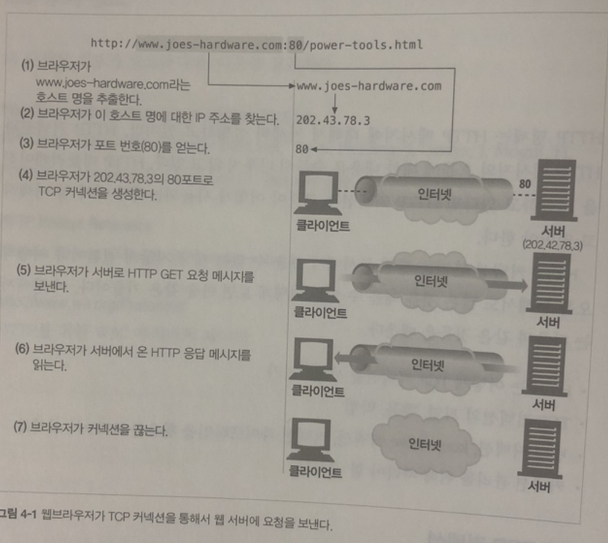
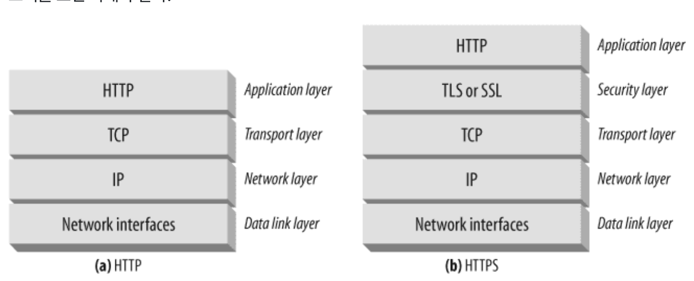
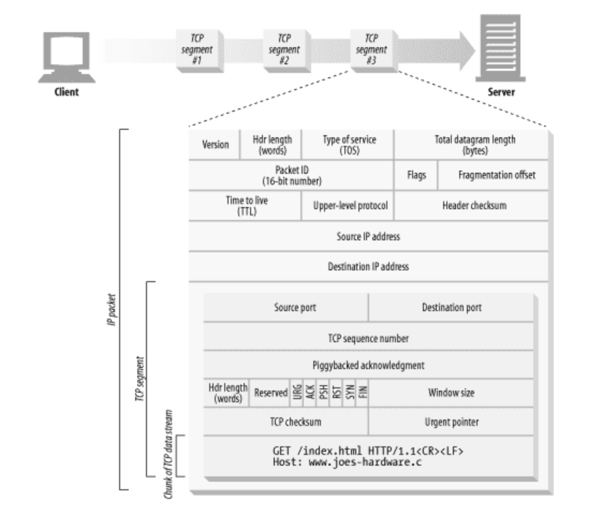
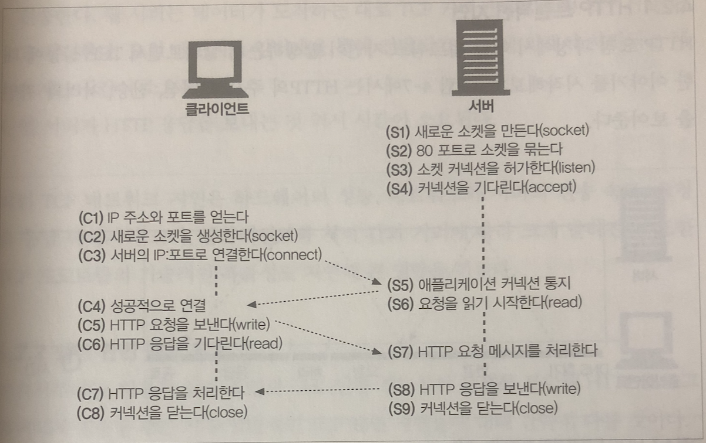
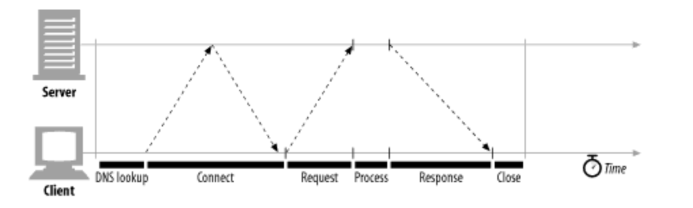
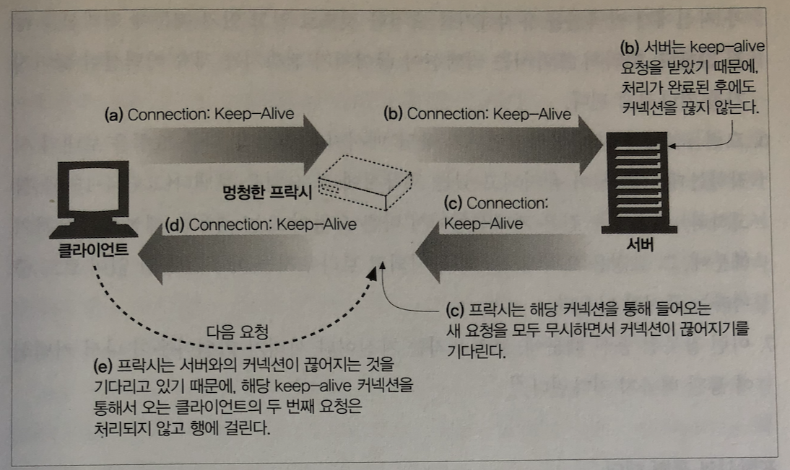
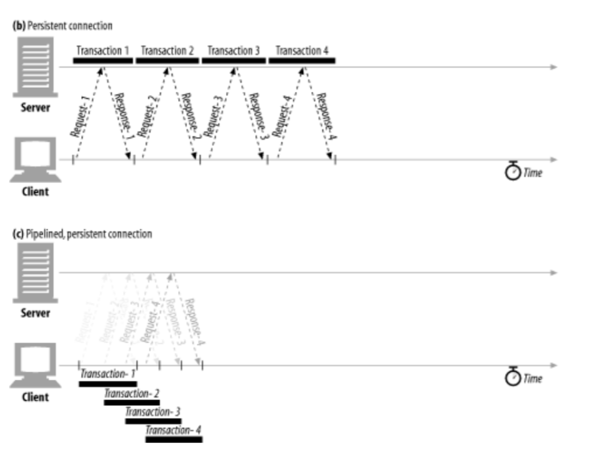

## 커넥션 관리

### TCP 커넥션

웹브라우저가 TCP커넥션을 통해 요청을 보내는 법



- TCP는 **신뢰**할 수 있다

#### TCP 스트림은 세그먼트로 나뉘어 IP패킷을 통해 전송된다.

TCP는 세그먼트라는 단위로 데이터 스트림을 잘게 나누고, 세그먼트를 IP 패킷으로 감싸서 전달함.



<프로토콜 스택>



#### TCP 커넥션 유지하기

- TCP는 포트 번호를 통해 여러 개의 TCP 커넥션 유지

- TCP 커넥션은 네가지 값으로 식별

  - `<발신지 IP 주소, 발신지 포트, 수신지 IP주소, 수신지 포트`

  - 서로 다른 커넥션은 4가지 모두 같을 수 없음


#### TCP 소켓 프로그래밍

- 소켓 API는 HTTP 프로그래머에게 TCP/IP 세부사항을 숨김
- 소켓 API는 핸드셰이킹, TCP 데이터 스트림과 IP 패킷 간의 분할 및 재조립에 대한 세부사항을 숨김



<클라이언트와 서버가 TCP 소켓 인터페이스를 사용하여 상호작용하는 방법>


### TCP 성능에 대한 고려

> HTTP는 TCP 위 계층이므로 TCP 성능에 매우 의존적이다.



트랜잭션 처리 시간은 TCP 커넥션을 설정하고, 요청을 전송하고, 응답 메시지를 보내는 시간보다 짧음!

#### 트랜잭션 지연 원인

1. 클라이언트는 URL의 IP와 포트 번호를 알아내야한다.(DNS)
2. 클라이언트는 TCP 연결 요청을 서버에게 보내야하고 회신을 기다림
3. 커넥션이 맺어지면 HTTP 요청을 TCP 파이프를 통해 전송한다. 또한 요청 메시지가 처리되는 데 시간이 걸림
4. 웹 서버가 응답을 보내는 시간이 걸림.


#### TCP 커넥션 핸드셰이크 지연

핸드셰이크 순서

1. 클라이언트가 TCP 커넥션을 생성하기 위해 TCP 패킷을 보낸다.
   - SYN (생성 요청)
2. 서버가 커넥션을 받으면 요청이 받아들여졌음을 의미하는 TCP 패킷을 보낸다.
   - SYN + ACK
3. 클라이언트가 커넥션이 잘 맺어졌음을 알리기 위해서 서버에 다시 확인 응답 신호를 보낸다.
   - ACK
   - 데이터와 함께 보낼 수 있음.

HTTP 프로그래머는 커넥션의 핸드셰이크를 보지 못한다. 커넥션을 생성하는 것은 사실 굉장한 비용이라고 할 수 있다. 왜냐면 총 세 번의 네트워크 비용이 발생하기 때문이다. 이렇게 어렵게 매번 커넥션을 만들지 않고 재활용 하자.


#### 확인 응답 지연

인터넷은 패킷 전송을 보장하지 않는다 -> TCP가 신뢰성을 가지기 위해서는 확인 체계가 필요

- TCP 세그먼트는 **순번과 데이터 무결성 체크섬**을 가짐
- 이 값은 하나의 비트기 때문에 이 비트 하나를 위한 패킷을 만들기에는 아깝다. 그렇기 때문에 방향이 같은 다른 패킷에 동승(piggyback)한다. 확인응답 지연은 효율적으로 확인응답을 보내기 위해 동승할 패킷을 위해 기다리는 행위이다. 기다리다 늦어지면 물론 별도의 패킷을 만들어야 한다.


#### TCP 느린 시작

TCP 커넥션 생성 후 네트워크에 따라 성능에 영향을 미침

- 낮은 속도로 보내다가 성공적으로 전송될 때마다 속도를 높여간다


그 외

- Nage 알고리즘과 TCP_NODLAY
- Time_Wait의 누적과 포트 고갈.


### HTTP 커넥션 관리

#### 잘못 이해하는 Connection 헤더

- 클라이언트와 서버 사이에 프락시, 캐시 서버등 중개 서버가 있을 때 두 개의 인접한 HTTP 애플리케이션이 현재 맺고 있는 커넥션에만 적용될 옵션을 지정해야 할 때가 있음

- HTTP 커넥션 헤더 필드는 커넥션 토큰을 쉼표로 구분하고 있으며, 그 값들은 다른 커넥션에 전달되지 않음

- 커넥션 헤더에는 다음 세 가지 종류의 토큰을 전달 할 수 있음

  - HTTP 헤더 필드명은, 이 커넥션에만 해당되는 헤더들을 나열한다.
  - 임시적인 토큰 값은, 커넥션에 대한 비표준 옵션을 의미한다.
  - Close 값은, 커넥션이 작업을 완료되면 종료되어야 함을 의미한다.

  

#### 순차적인 트랜잭션 처리에 의한 지연

- 사용자는 여러 개의 이미지가 동시에 로드 되기를 기대함
  - 하지만 순차적 로드 방식일 때는 모든 객체를 내려 받을 때까지 기다려야함
- 커넥션 성능 향상을 위한 기술
  - 병렬 커넥션
  - 지속 커넥션
  - 파이프라인 커넥션
  - 다중 커넥션


#### 병렬 커넥션

> 여러 개의 TCP 커넥션을 통한 동시 HTTP 요청

- 여러 개의 커넥션을 통해 각 커넥션의 지연 시간을 겹치게 하여 총 지연 시간을 줄일 수 있다
- 항상 빠르지만은 않다
  - 네트워크 대역폭이 좁을 때 커넥션마다의 지연이 발생하여 느려길 수 있다.
- 항상 빠르진 않지만 빠르게 느낄 수 있다
  - 여러 개의 객체가 동시에 보이면서 내려받고 있는 상황을 볼 수 있기 때문에 사용자는 더 빠르게 내려받고 있는 것처럼 느낀다.
- 단점
  - 각 트랜잭션마다 새로운 커넥션을 맺고 끊기 때문에 시간과 대역폭이 소요된다.
  - 각각의 새로운 커넥션은 TCP 느린 시작 때문에 성능이 떨어진다.
  - 실제로 연결할 수 있는 병렬 커넥션의 수에는 제한이 있다


#### 지속 커넥션

> 처리가 완료된 후에도 계속 연결된 상태로 있는 TCP 커넥션

- 커넥션을 맺기 위한 사전작업과 지연을 줄여주고, 튜닝된 커넥션을 유지하며, 커넥션 수를 줄여준다.

- 병렬 커넥션과 함께 사용시 효과적

- Keep-Alive

  - Connections: Keep-Alive 헤더
  - 없으면 커넥션을 종료
  - Timeout : 얼마나 유지할 지
  - Max : 몇개의 HTTP 트랜잭션을 처리할 때까지 유지할지

  ```
  Connection: Keep-Alive
  Keep-Alive: max=5, timeout=120
  ```

- Keep-alive와 멍청한 프락시

  - Connection 헤더의 무조건 전달
    - 프락시는 Connection 헤더를 이해하지 못해서 해당 헤더를 삭제하지 않고 요청 그대로 다음 프락시에 전달
    - 프락시는 Keep-alive를 전혀 모르지만, 받았던 모든 데이터를 그대로 클라이언트에게 전달하고 나서 서버가 커넥션 끊기를 기다림. 그러나 서버는 프락시가 커넥션을 유지하길 요청한 것으로 알고 있기 때문에 커넥션을 끊지 않음. 따라서 프락시는 커넥션이 끊어지기 전까지 무작정 기다리게 됨.
    - 타임아웃이 나서 커넥션이 끊길 때까지 기다리게 됨
    - 결론 : 프락시는 connection 헤더들을 절대 전달하면 안됨

  

- Proxy-Connection 

  - 멍청한 Proxy는 Proxy-Connection 값을 그대로 전달하고 똑똑한 프락시는 Connection으로 변경한다.
  - 하지만 중간에 하나 이상의 멍청한 프락시가 있을 경우 문제 발생


- HTTP/1.1 지속 커넥션
  - 별도 설정 없이 모두 지속 커넥션
  - HTTP/1.1 애플리케이션은 트랜잭션이 끝난 다음 커넥션을 끊으려면 `Connection: close` 그러나 명시하지 않는다고 해서 영원히 커넥션이 유지되는 것은 아님. 서버/클라이언트가 언제든 끊을 수 있음.


#### 파이프라인 커넥션

- HTTP/1.1은 지속 커넥셩을 통해서 요청을 파이프라이닝 할 수 있음. Keep-Alive 성능을 높여줌



- HTTP 클라이언트는 커넥션이 지속 커넥션인지 확인하기 전까지 파이프라인을 이어서는 안됨
- HTTP 응답은 요청 순서와 같게 와야 함
- HTTP 클라이언트는 커넥션이 언제 끊어지더라도 완료되지 않은 요청이 파이프라인에 있으면 언제든 다시 요청을 보낼 준비가 되어 있어야 한다.
- HTTP 클라이언트는 POST 요청같이 반복해서 보낼 경우 문제가 생기는 요청은 파이프라인을 통해 보내면 안됨


#### 커넥션 끊기에 대한 미스터리

- 커넥션 관리에는 명확한 기준이 없다.
- 보통 에러가 발생하면 끊기지만, 에러가 있는 상황에서는 헤더 중간이나 다른 엉뚱한 곳에서 끊길 수 있다.
  - 요청 데이터 전송 후 응답이 오기 전에 커넥션이 끊기면 서버에서 요청을 얼마나 처리했는지 전혀 알 수 없음
- 한 번 혹은 여러 번 실행됐는지에 상관 없이 같은 결과를 반환한다면, 그 트갠잭션은 **멱등**하다
  - GET, HEAD, PUT, DELETE, TRACE, OPTIONS 등이 멱등함(POST X)
  - 그 외에 메서드는 파이프라인을 통해 요청하면 안 됨.

우아한 커넥션 끊기

- 전체 끊기와 절반 끊기
  - 애플리케이션은 TCP 입력 채널과 출력 채널 중 한 개만 끊거나 둘 다 끊을 수 있음
  - 전체 끊기 : `close()`를 호출하여 TCP 커넥션의 입력 채널과 출력 채널의 커넥션을 모두 끊는다.
  - 절반 끊기 : `shotdown()`을 호출하여 입력 채널이나 출력 채녈 중 하나를 개별적으로 끊음
- TCP 끊기와 리셋 에러
  - 파이프라인 지속 커넥션을 사용할 때, 기기들에 예상치 못한 쓰기 에러를 발생하는 것을 예방하기 위해 '절반 끊기'를 사용
    - 출력 채널을 끊는 것이 안전, 데이터 전송이 끊남과 동시에 커넥션이 끊었다는 것을 알게 되므로
  - 클라이언트에서 더는 데이터를 보내지 않을 것임을 확신할 수 없는 이상, 커넥션의 입력 채널을 끊는 것은 위험하다
    - 클라이언트가 이미 끊긴 입력 채널에 데이터를 전송하면 `connection reset by peer` 메시지를 받고, 대부분의 os에서 이를 심각한 에러로 취급하여 버퍼에 저장된, 아직 읽히지 않은 데이터를 모두 삭제함. 파이프라인 커넥션이 악화됨.
  - 우아하게 커넥션 끊기
    - 일반적으로 애플리케이션 자신의 출력 채널을 먼저 끊고 다른 쪽에 있는 기기의 출력 채널이 끊기는 것을 기다리는 것
    - 안타깝게도 상대방이 절반 끊기를 구현했다는 보장이 없기 때문에 출력 채널에 절반 끊기를 한 후에도 데이터나 스트림의 끝을 식별하기 위해 입력 채널에 대해 상태 검사를 주기적으로 해야 함


> 참고 

https://yurimkoo.github.io/http/2019/08/23/http-the-definitive-guide-1-4.html

http://tlog.tammolo.com/blog/4-cf6edc94-2ac1-4b59-b7bd-99b5fbb00287/