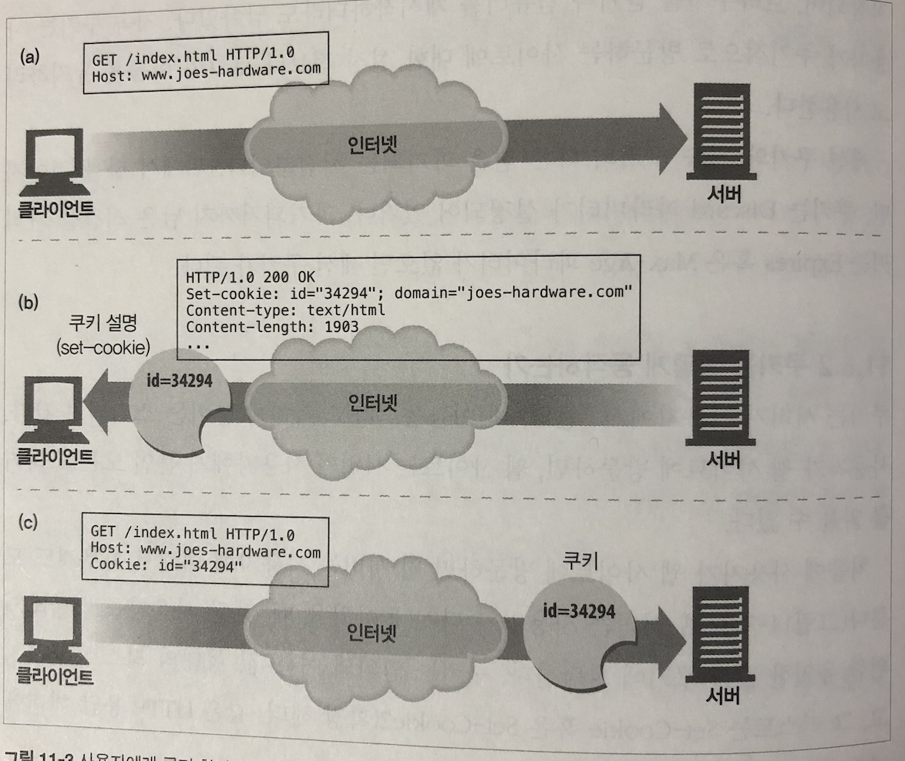

## 클라이언트 식별과 쿠키

### 개별 접촉

> HTTP는 익명으로 사용하며 상태가 없고 요청과 응답으로 통신하는 프로토콜이다.

#### 개별 인사

온라인 쇼핑이 개인에게 맞춰져 있는 것처럼 느끼게 하려고 사용자에게 특화된 환영 메시지나 페이지 내용을 만든다


#### 사용자 맞춤 추천

온라인 상점은 고객의 흥미가 무엇인지 학습해서 고객이 좋아할 것이라고 예상되는 제품들을 추천한다.


#### 저장된 사용자 정보

온라인 쇼핑에 사용자를 한번 식별하고 나면, 쇼핑을 더 편하게 할 수 있도록 저장된 사용자 정보를 사용할 수 있다.


#### 세션 추적

HTTP 트랜잭션은 상태가 없다. 각 요청 및 응답은 독립적으로 일어난다. 많은 웹사이트에서 사용자가 사이트와 상호작용할 수 있게 사용자의 상태를 남긴다.

- HTTP 트랜잭션을 식별한 방법이 필요해짐
  
  - HTTP 헤더들
  
  - IP 주소
  
  - 로그인 인증
  
  - 쿠키


### HTTP 헤더

- From 헤더는 사용자의 이메일 주소를 포함
  
  - 이메일 주소를 통해 사용자를 식별
  
  - 스팸 메일을 발송하는 문제가 있음

- User-Agent 헤더는 사용자가 쓰고 있는 브라우저의 이름과 버전 정보, 운영체제에 대한 정보를 포함
  
  - 특정 브라우저에서 제대로 동작하도록 속성에 맞추어 콘텐츠를 최적화하는 데 유용

- Referer 헤더는 사용자가 현재 페이지로 유입하게 한 웹페이지의 URL을 가르킴
  
  - 사용자의 취양을 파악하는 데 유용함.


### 클라이언트 IP주소

클라이언트의 IP주소는 HTTP에 존재하지 않지만 웹 서버는 HTTP 요청을 보내는 반대쪽 TCP 커넥션의 IP 주소를 알어낼 수 있음.

- IP 주소로 사용자를 식별하는 방식의 문제점
  
  - 클라이언트 IP는 사용자가 아닌, 사용하는 컴퓨터이다.
  
  - ISP는 사용자가 로그인하면 동적으로 IP주소를 할당함. 로그인한 시간에 따라 매번 다른 주소를 할당하므로, 사용자를 식별하기 힘듬
  
  - 네트워크 주소 변환(NAT) 자비들은 클라이언트의 실제 IP 주소를 방화벽 뒤로 숨기고, 이를 내부에서 사용하는 하나의 방화벽 주소로 변환한다.
  
  - HTTP 프락시와 게이트웨이는 원 서버에 새로운 TCP 연결을 한다. 웹 서버는 클라이언트의 IP 주소 대신 프락시 서버의 IP 주소를 본다.


### 사용자 로그인

> 사용자의 이름과 비밀번호로 인증할 것을 요구하여 명시적으로 식별 요청을 할 수 있다.

HTTP는 웹 사이트 로그인이 더 쉽도록 `WWW.Authenticate`와 `Authentication` 헤더를 사용하여 웹사이트로 사용자 이름을 전달하는 자체적인 체계를 가지고 있다.

- 로그인하면 브라우저는 사이트로 보내는 요청에 로그인 정보를 함께 보내 웹 사이트가 이를 확인 할 수 있다.

- `Autehntication`헤더는 암호화 되어있어 네트워크 상에서 알아보지 못한다. 또한 브라우저가 로그인 정보를 기억하여 매 요청마다 로그인하지 않도록 한다.


1. 브라우저가 www.joes-hardware.com 사이트에 요청

2. 사이트는 사용자의 식별정보를 알지 못하여 `401 Login Required`와 `WWW-Authenticate`헤더를 반환하여 로그인을 요구한다

3. 사용자가 iD, 비밀번호를 입력후 식별을 시도

4. 서버는 식별정보를 안다 또한 로그인 정보를 요구하면 브라우저는 자동으로 식별정보를 포함하여 보낸다.


### 뚱뚱한 URL

> 웹 서버가 URL에 있는 상태 정보를 유지하는 하이퍼링크를 동적으로 생성한다.

사용자가 웹 사이트에 처음 방문하면 유일한 ID가 생성되고, 그 값은 서버가 인식할 수 있는 방식으로 URL에 추가되며, 서버는 클라이언트를 이 뚱뚱한 URL redirect 시킨다.


문제점

- 못생긴 URL 

- 공유하지 못하는 URL

- 캐시를 사용할 수 없음.

- 서버 부하 가중 - 뚱뚱한 URL에 해당하는 HTML 페이지 재생성

- 이탈 - 

- 세션 간 지속성의 부재 - 사용자가 URL을 북마킹하지 않는 이상, 로그아웃하면 모든 정보를 잃는다. 세션 간 지속성 부족


### 쿠키

> 사용자를 식별하고 세션을 유지하는 방식 중에서 가장 널리 사용하는 방식

쿠키는 새로운 HTTP 헤더를 정의. 캐시와 충돌할 수있어서, **캐시나 브라우저는 쿠키에 있는 내용물을 캐싱하지 않는다**.

#### 쿠키의 타입

- 세션 쿠키와 지속쿠키
  
  - 세션 쿠키 : 사용자가 사이트를 탐색할 때, 관련된 설정과 선호 사항들을 저장하는 임시 쿠키
  
  - 지속 쿠키 : 디스크 안에 저장되어, 브라우저를 닫거나 컴퓨터를 재시작하더라도 남아있음. 사용자가 주기적으로 방문하는 사이트에 대한 설정 정보나 로그인 이름을 유지할 때 사용


#### 쿠키의 동작 방법

1. 사용자가 웹 사이트 방문하면 사용자를 식별하는 유일한 값인 쿠키 할당

2. 브라우저는 서버로부터 온 cookie 헤더에 있는 컨텐츠를 브라우저 쿠키 DB에 저장한다.

3. 사용자가 재방문시 브라우저는 쿠키를 Cookie 요청 헤더에 기술해 전송한다.




#### 쿠키 상자 : 클라이언트 측 상태

브라우저는 쿠키 정보를 저장할 책임이 있는데, 이 시스템을 클라이언트 측 상태라고 함. HTTP 상태 관리 체계


#### 사이트마다 각기 다른 쿠키들

브라우저는 사이트당 2-3개의 쿠키만 보낸다.

- 많은 쿠키는 성능을 저하시킴

- 이름/값 쌍을 포함하기 때문에 대부분의 사이트에서 인식하지 않는 무의미한 값일 수 있다.

- 쿠키 전체를 전달하는 것은 개인정보 문제를 야기함.


#### 쿠키 구성요소

Version 0 쿠키

- Set-Cookie응답 헤더와 Cookie 요청 헤더, 쿠키를 조작하는 데 필요한 필드로 정의

```textile
Set-Cookie: name=value [; expires=date][; path=path][;domain=domain][;secure]
Cookie: name1=value1 [;name2=value2]
```

- Set-Cookie : 쿠키의 이름과 값을 가져야함.

- Cookie 
  
  - Domain, Path, Secure 필터들이 현재 요청하려고 하는 사이트에 들어맞으면서 아직 파괴되지 않는 쿠키들을 함께 보냄


쿠키와 세션 추척

- 쿠키는 웹 사이트에 수차례 트랜잭션을 만드러내는 사용자를 추적하는 데 사용


쿠키와 캐싱

- 쿠키 트랜잭션과 관련된 문서를 캐싱하는 것은 주의해야 한다. 쿠키가 다른 사용자에게 할당돼버리거나, 누군가의 개인 정보가 다른 이에게 노출될 수도 있다.
  
  - `Cache-Control: no-cache="Set-Cookie"`

- Set-Cookie 헤더를 캐시 하는 것에 유의하라
  
  - 같은 `Set-Cookie` 헤더를 여러 사용자에게 보내면 사용자 추적에 실패할 것이다. 또한, 어떤 캐시는 응답을 저장하기 전에 `Set-Cookie` 헤더를 제거하기에, 클라이언트는 해당 헤더 정보가 없는 데이터를 받게 된다.

- Cookie 헤더를 가지고 있는 요청을 주의해라
  
  - 결과 컨텐츠가 개인정보를 담고 있을 수도 있다. 개인정보는 **캐시되지 않도록** 해야하지만, 그렇지 하지 않는 서버도 있다. 보수적인 캐시는 `Cookie` 헤더가 포함된 요청에 대한 응답으로 오는 문서는 캐시하지 않는다


쿠키, 보안 그리고 개인정보

- 쿠키를 사용하지 않도록 비활성화 시킬 수 있고, 로그 분석 같은 다른 방법으로 대체하는 것이 가능하다.

- 쿠키의 잘못된 오용만 줄인다면 쿠키의 위허성보다 편리함이 더 크다


