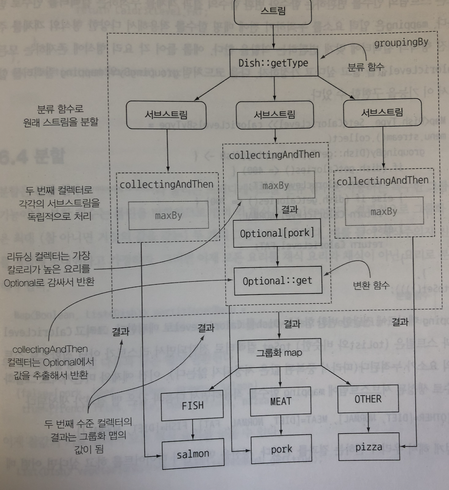

## java8 - Stream

### 스트림이란 무엇인가?

스트림 : 컬렉션이나 배열의 반복을 멋지게 처리하는 기능

- 멀티 스레드 코드를 구현하지 않아도 데이터를 투명하게 병렬로 처리함.

```java
//기존 코드
List<Dish> lowCaloricDishes = new ArrayList<>();
for(Dish d : menu){
  if(d.getCalories() < 400){
    lowCaloricDishes.add(d);
  }
}

Collections.sort(lowCaloricDishes, new Comparator<Dish>(){
  public int compare(Dish d1, Dish d2){
    return Integer.compare(d1.getCalories(), d2.getCalories());
  }
});
  
List<String> lowCaloricDishesName = new ArrayList<>();
for(Dish d: lowCaloricDishes){
  lowCaloricDishesName.add(d.getName());
}

//java 8
List<String> lowCaloricDishesName = menu.stream()
  .filter(d->d.getCalories() < 400)
  .sorted(comparing(Dishes::getCalories))
  .map(Dish::getName)
  .collect(toList());
```

- 선언형으로 코드 구현
- 데이터 처리 과정을 병렬로 함 -> 락을 걸 필요가 없음 - 성능이 좋아짐
- 유연성이 좋아짐


### 스트림

> 데이터 처리 연산을 지원하도록 소스에서 추출된 연속된 요소

- 연속된 요소
- 소스 : 컬렉션, 배열 , I/O 자원 등의 데이터 제공 소스로 부터 데이터를 소비
- 데이터 처리 연산 : filter, map, reduce, find, match, sort 등
- 파이프라이닝
- 내부 반복

#### 컬렉션과의 차이

= 데이터를 **언제** 계산 하느냐

컬렉션 - 컬렉션이 추가되기 전에 계산되어야함 - 컬렉션의 모든 요소를 메모리에 저장해야함, 추가하려는 요소는 미리 계산 되어야함.

스트림

- 요청할 때만 요소를 계산 - 사용자가 요청할 때만 값을 계산함

- 딱 한번만 탐색함 - 탐색된 스트림의 요소는 소비됨.

  ```java
  List<String> title = Arrays.asList("Java8", "In", "Action");
  Stream<String> s = title.stream();
  s.forEach(System.out::println);
  s.forEach(System.out::println); //error
  ```

- 외부반복(컬렉션에서 직접 요소를 반복)과 내부반복(스트림에서 알아서 처리)

  - 내부함수가 좋은 이유
    - 투병하게 병렬로 처리하거나 더 최적화된 다양한 순서로 처리할 수 있음.
    - 우리가 신경쓰지 않아도됨

**중간연산**

```java
List<String> menus = 
  menu.stream()
  .filter(d -> {
    System.out.println("filtering" + d.getName());
    return d.getCalories() > 300;
  })
  .map(d -> {
    System.out.println("mapping"+ d.getName());
    return d.getName();
  })
  .limit(3)
  .collect(toList());
```

```
filtering pork
mapping pork
filtering beef
mapping beef
filtering chicken
mapping chicken
//그 이상은 필터링 하지 않음
```

- Filter, map, limit, sorted, distinct


**최종연산**

-  Count, forEach, collect


### 스트림 활용

#### 필터링과 슬라이싱

**플레디케이트로 필터링**

```java
List<Dish> vegetarianMenu = menu.stream()
    .filter(Dish::isVegetarian)
    .collect(toList());
```

**고유 요소 필터링**

```java
List<Integer> numbers = Arrays.asList(1, 2, 1, 3, 3, 2, 4);
numbers.stream()
    .filter(i -> i % 2 ==0)
    .distinct() //중복 요소 제거
    .forEach(System.out::println);
```

**스트림 축소**

```java
List<Dish> dishes = menu.stream()
    .filter(d -> d.getCalories() > 300)
    .limit(3) //최대 n개의 요소를 반환
    .collect(toList());
```

**요소 건너뛰기**

```java
List<Dish> dishes = menu.stream()
    .filter(d -> d.getCalories() > 300)
    .skip(2) // n 단계 건너 뛰기
    .collect(toList())
```


#### 매핑

**flatMap**

```java
List<String> uniqueCharacters = 
    words.stream()
    .map(w -> w.split(""))
    .flatMap(Arrays::stream) //평면화된 스트림을 반환 배열이 아닌 요소 하나씩
    .distinct()
    .collect(Collectors.toList()); 
```


#### 검색과 매칭

**프레디케이트가 적어도 한 요소와 일치하는 지 확인**

```java
if(menu.stream().anyMatch(Dish::isVegetarian)){
    System.out.println("The menu is (someWhat) vegetarian friendly!");
}
```

**모든 요소와 일치하는지 검사**

```java
boolean isHealthy = menu.stream().allMatch(d -> d.getCalories < 1000);
```

반대

```java
boolean isHealty = menu.stream().nonMatch(d -> d.getCalories() >= 1000);
```


**요소 검색**

```java
Optiopnal<Dish> dish = menu.stream()
    .filter(Dish::isVegetarian)
    .findAny();
```

Optional 이란

값의 존재나 부재 여부를 표현하는 컨테이너 클래스

- isPresent() 값 포함 여부
- ifPresent(Consumer<T> block)
- T get() 값 존재하면 봔한 없으면 NoSuchElementException
- T orElse(T other)


findFirst() - 첫번째 요소

```java
List<Integer> somNumbers = Arrays.asList(1, 2, 3, 4, 5);
Optional<Integer> firstSquareDivisibleByThree = someNumbers.stream()
    .map(x -> x*x)
    .filter(x -> x%3 == 0)
    .findFirst();
```


#### 리듀싱

**요소의 합**

기존

```java
int sum = 0;
for (int x ; numbers){
    sum+=x;
}
```

-> stream

```java
int sum = numbers.stream().reduce(0, (a, b) -> a + b);
```

```java
int sum = numbers.stream().reduce(0, Integer::sum);
```

-> 초기값이 없다면

```java
Optional<Integer> max = numbers.stream().reduce(Integer::max);
```

- Optional 객체를 리턴함


**reduce 메서드의 장점과 병렬화**

- 병렬로 reduce를 실행할 수 있음

  ```java
  int sum = numbers.parallelStream().reduce(0, Integer::sum);
  ```


### 실전 연습

1. 2011년에 일어난 모든 트랜잭션을 찾아 값을 오름차순으로 정리하시오.

   ```java
   transactions.stream()
       .filter(transaction -> transaction.getYear() == 2011)
       .sorted(comparing(Transaction::getValue))
       .collect(toList())
   ```

2. 거래자가 근무하는 모든 도시를 중복 없이 나열하라.

   ```java
   List<String> cities = transaction.stream()
       .map(transaction -> transaction.getTrader().getCity())
       .distinct()
       .collect(toSet());
   ```

3. 케임브리지에 근무하는 모든 거래자를 찾아서 이름순으로 정렬하라

   ```java
   List<Trader> traders = transcations.stream()
       .map(Transaction::getTrader)
       .filter(trader -> trader.getCity().equals("Cambridge"))
       .distinct()
       .sorted(comparing(Trader::getName))
       .collect(toList());
       
   ```

4. 모든 거래자의 이름을 알파벳순으로 정렬해서 반환하라

   ```java
   String traderStr = transactions.stream()
       .map(transaction -> transaction.getTrader().getName())
       .distinct()
       .sorted()
       .reduce("", (n1, n2)->n1+n2); //collect(joining())
   ```

5. 밀라노에 거래자가 있는가?

   ```java
   boolean milanBased = transaction.stream()
       .anyMatch(transaction -> transaction.getTrader().getCity().equals("Milan"))
   ```

6. 케임브리지에 거주하는 거래자의 모든 트랜잭션값을 출력하시오

   ```java
   transactions.stream()
       .filter(t -> "Cambridge".equals(t.getTrader().getCity()))
       .map(Transaction::getValue)
       .forEach(System.out::println);
   ```

7. 전체 트랜잭션 중 최댓값은 ?

   ```java
   Optional<Integer> hightestValue = transaction.stream()
       .map(Transaction::getValue)
       .reduce(Integer::max)
   ```

8. 전체 트랜잭션 중 최솟값은?

   ```java
   Optional<Transaction> smallestTransaction = transactions.stream()
       .min(comparing(Transaction::getValue))
   ```

   

### 숫자형 스트림

기존 스트림

```java
int calories = menu.stream()
    .map(Dish::getCalories)
    .reduce(Integer::sum);
```

->

```java
int calories = menu.stream()
    .map(Dish::getCalories)
    .sum();
```

안됨!!! why? 스트림 의 요소 형식은 Integer지만 인터페이스에는 sum  메서드가 없다.

-> 기본형 특화 스트림 등장

```java
int calories = menu.stream()
    .mapToInt(Dish::getCalories)
    .sum(); //IntStream 인터페이스에서 제공하는 sum메서드 이용
```

IntStream 에서 다시 Stream으로 돌아가려면?

```JAVA
Stream<Integer> stream = intStream.boxed();
```

but 요소가 없을 때 기본으로 0을 반환함 -> 문제를 일으킬 수 있음.

OptionalInt

```java
OptionalInt maxCalories = menu.stream()
    .mapToInt(Dish::getCalories)
    .max();

int max = maxCalories.orElse(1);
```


**숫자 범위**

특정 범위의 숫자를 이용해하는 상황

```java
IntStream evenNumbers = IntStream.rangeClosed(1, 100)
    .filter(n -> n % 2 == 0); //1 - 100 까지 짝수 스트림

system.out.println(evenNumbers.count());
```


### 스트림 만들기

```java
Stream<String> stream = Stream.of("Java 8", "Lambdas ", "In ", "Actions");
stream.map(String::toUpperCase).forEach(System.out::println);

Stream.empty(); //빈 스트림 만들기
```

배열일 때

```java
int[] numbers = {2, 3, 5, 7, 11, 13};
int sum = Arrays.stream(numbers).sum(); //intstream 생성됨
```

파일일 때

```java
long uniqueWords = 0;
try(Stream<String> lines = 
    Files.lines(Paths.get("data.txt"), Charset.defaultCharset())){
    uniqueWords = lines.flatMap(line -> Arrays.stream(line.split(" ")))
        .distinct()
        .count();
}catch(IOException e){
    
}
```


iterate

```java
Stream.iterate(0, n -> n+2 )
                .limit(10)
                .forEach(System.out::println);
0
2
4
6
8
10
12
14
16
18
```

iterate 무한 스트림을 만든다


generate

```java
Stream.generate(Math::random)
                .limit(5)
                .forEach(System.out::println);
```

새로운 값을 생산한다.

iterate나 generate 모두 limit가 없으면 언 바운드 상태가 됨. 무한...

```java
IntSupplier fib = new IntSupplier(){
            private int previous = 0;
            private int current =1;
            public int getAsInt(){
                int oldPrevious = this.previous;
                int nextValue = this.previous + this.current;
                this.previous = this.current;
                this.current = nextValue;
                return oldPrevious;
            }
        };

IntStream.generate(fib).limit(10).forEach(System.out::println); //계산 중에선 fib 가변 객체임
```


### 스트림으로 데이터 수집


기존 코드

```java
Map<Currency, List<Transaction>> transactionsByCurrencies = new HashMap<>();

for(Transaction transaction : transactions){
  Currency = transaction.getCurrencty();
  List<Transaction> transactionsForCurrency = transactionsByCurrencies.get(currency);
  
  if(transactionsForCurrency == null){
    transactionsForCurrency.put(currencty, transactionsForCurrency);
  }
  
  transactionsForCurrency.add(transaction);
}
```

stream

```java
Map<Currency, List<Transaction>> transactionsByCurrencies = transactions.stream().collect(groupingBy(Transaction::getCurrency));
```


### 컬렉터란?

함수형 프로그래밍 : '무엇'을 얻을지 직접 명시 but 어떤 방법으로 얻을지는 노관심

**리듀싱 기능을 수행하는 컬렉터**

위 코드에서 스트림이 각 트랜잭션을 탐색하고 currency를 추출하여 group 하는 과정을 직접 구현하지 않아도 됨

가장 많이 사용하는 것 toList()

```java
List<Transaction> transactions = transactionsTream.collect(Collector.toList());
```


컬렉터가 제공하는 기능

- 스트림 요소를 하나의 값으로 리듀스하고 요약
- 요소 그룹화
- 요소 분할


### **리듀싱과 요약**

Collector.counting -> `import static java.util.stream.Collector.*;` 추가 후 -> count()

```java
long howManyDishes = menu.stream().count();
```


**최댓값과 최솟갑 구하기**

```java
Comparator<Dish> dishCaloriesComparator = Comparator.comparingInt(Dish::getCalories);

Optional<Dish> mostCaloriesDish = menu.stream()
  .collect(maxBy(dishCaloriesComparator));
```

스트림에 있는 객체의 숫자 필드의 합계나 평균 등을 반환하는 연산에 리듀싱 기능이 사용되는 것 = 요약


**요약 연산**

Collectors.summingInt 활용

```java
int totalCalories = menu.stream().collect(summingInt(Dish::getCalories));
```

초기값 0에서 시작해서 객체를 getCalories 로 변환후 더한다

average

```java
double avgCalories = menu.stream().collect(averagingInt(Dish::getCalories));
```

summarizing (요약된 정보를 객체로 반환)

```java
IntSummaryStatistics menuStatistics = menu.stream().collect(summarizingInt(Dish::getCalories));

IntSummaryStatistics {
  count = 9, sum = 4300, min =120,
  average = 477.777778, max = 800
}
```


**문자열 연결**

```java
String shortMenu = menu.stream().map(Dish::getName).collect(joining());
```

- joining 메서드는 StringBuilder를 이용해서 문자열은 만들어줌

```java
String shortMenu = menu.stream().collect(joining());
```

toString 사용시 map 사용 안해도됨.


구분자를 넣고 싶다면?

```java
String shortMenu = menu.stream().collect(joining(", "));
```

- 그냥 넣으면 됨


**범용 리듀싱 요약 연산**

collector를 활용한 것들은 reduce 로 다 구현 가능 (편리함 때문에 collector 사용)

reducing

- 첫번째 인자는 인수가 없을 때 반환값
- 변환식
- 계산식

```java
int totalCalories = menu.stream().collect(reducing(0, Dish::getCalories, (i, j) -> i + j));
```

한개의 인수를 가질 때는?

```java
Optional<Dish> mostCalorieDish = menu.stream().collect(reducing((d1, d2)-> d1.getCalories() > d2.getCalories() ? d1 : d2));
```


언제 collect, reducing을 사용해야하나?

새로운 객체를 할당하면 성능 저하가 일어나므로 collect 사용하는 게 더 좋음


**여러가지 방법 **

```java
int totalCalories = menu.stream().collect(reducing(0, Dish::getCalories, Integer::sum));
```

```java
int totlaCalories = menu.stream().map(Dish::getCaloreis).reduce(Integer::sum).get();
```

```java
int totalCalories = menu.stream().mapToInt(Dish::getCalories).sum();
```

상황에 따라서 선택하면됨.


### 그룹화

```java
Map<Dish.Type, List<Dish>> dishesByType = menu.stream().collect(groupingBy(Dish::getType));
```

스트림 -> 분류함수 -> 그룹화 맵에 분류


**다수준 그룹화**

```java
Map<Dish.Type, Map<CaloricLevel, List<Dish>> = dishesByTypeCaloricLevel = 
  menu.stream().collect(
		groupingBy(Dish::getType, groupingBy(dish ->{
      if(dish.getCalories() <= 400){
        return CaloricLevel.DIET;
      }else if(dish.getCalories() <= 700){
        return CaloricLevel.NORMAL;
      }else{
        return CaloricLevel.FAT;
      }
    })));
```


**서브그룹 데이터 수집**

```java
Map<Dish.Type, Long> typesCount = menu.stream()
  .collect(groupingBy(Dish::getType, counting()))
```

```java
Map<Dish.Type, Optional<Dish>> mostCaloricByType = 
  menu.stream()
  	.collect(groupingBy(Dish::getType, maxBy(comparingInt(Dish::getCalories))))
```


**컬렉션 결과를 다른 형식에 적용하기**

```java
Map<Dish.Type, Dish> mostcaloricByType = =
  menu.stream()
  .collect(groupingBy(Dish::getType, collectingAndThen(
  		maxBy(comparingInt(Dish::getCalories)), Optional::get)));
```




### 분할

분할 함수라 불리는 프레디케이트를 분류 함수로 사용하는 특수한 그룹화 기능

- boolean 형식의 맵

```java
Map<Boolean, List<Dish>> partitionedMenu = menu.stream().collect(partitioningBy(Dish::isVegeterian));
```

```
{false = [pork, beef, chicken, prawns, salmon], 
true = [french fries, rice, season fruit, pizza]}
```

```java
List<Dish> vegetarianDishes = partitionedMenu.get(true); //true인 값을 모두 반환
//==
List<Dish> vegetarianDishes = menu.stream().filter(Dish::isVegetarian).collect(toList());
```


**분할의 장점**

분할 함수가 반환하는 참, 거짓 두 가지 요소의 스트림 리스트를 모두 유지한다는 것이 분할

```java
Map<Boolean, Map<Dish.Type, List<Dish>>> vegetarianDishesByType = menu.stream().collect(partitioningBy(Dish::isVegetarian, groupingBy(Dish::getType)));
```

```
{false = {FISH=[prawns, salmon], MEAT=[pork, beef, chicken]},
true = {OTHER=[french fries, rice, season fruit, pizza]}};
```

가장 칼로리가 높은 요리 찾을 시

```java
Map<Boolean, Dish> mostCaloricPartitionedByVegetarian = 
  menu.stream().collect(
		partitioningBy(Dish::isvegetarian, collectingAndThen(
    	maxBy(comparingInt(Dish::getCalories)), Optional::get
    )));
```

```
{false=pork, true=pizza}
```


**숫자를 소수와 비소수로 분할하기**

```java
public boolean isPrime(int candidate){
  return Intstream.range(2, candidate) //1 ~ candidate - 1까지의 수 생성
    .nonMatch(i -> candidate % i == 0); //나눌 수 없으면 참 반환
}
```

-> 더 연상량 줄이면?

```java
public boolean isPrime(int candidate){
  int candidateRoot = (int) Math.sqrt((double)candidate);
  return IntStream.rangeClosed(2, candidateRoot)
    .noneMatch(i -> candidate % i == 0);
}
```

-> partitioningBy을 활용하면?

```java
public Map<Boolean, List<Integer>> partitionPrimes(int n){
  return IntStream.rangeClosed(2, n).boxed()
    .collect(
  		partitioningBy(candidate -> isPrime(candidate)));
}
```


지금까지 배운 collector

| 팩토리 메서드 | 반환 형식     | 사용 예제                                                    |
| ------------- | ------------- | ------------------------------------------------------------ |
| toList        | List<T>       | 스트림의 모든 항목을 리스트로 수집                           |
| toSet         | Set<T>        | 스트림의 모든 항목을 중복이 없는 집합으로 수집               |
| toCollection  | Collection<T> | 스트림의 모든 항목을 공급자가 제공하는 컬렉션으로 수집ex) .collect(toCollection(), ArrayList::new); |


### Collector 인터페이스

```java
public interface Collector<T, A, R>{
  Supplier<A> supplier();
  BiConsumer<A, T> accumulator();
  Function<A, R> finisher();
  BinaryOperator<A> combiner();
  Set<Characteristics> characteristics();
}
```

- T는 스트림 항목의 제네릭
- A는 누적자, 수집 과정에서 중간 결과를 누적하는 객체의 형식
- R은 수집 연산 결과 객체의 형식


**supplier 메서드 **: 새로운 결과 컨테이너 만들기

supplier는 수집 과정에서 빈 누적자 인스턴스를 만드는 파라미터가 없는 함수

```java
public Supplier<List<T>> supplier(){
  return () -> new ArrayList<T>(); //ArrayList::new;
}
```


**accumulator 메서드**: 결과 컨테이너에 요소 추가하기

리듀싱 연산을 수행하는 함수를 반환

```java
public BiComsumer<List<T>, T>accumulator(){
  return (list, item) -> list.add(item); //List::add
}
```


**finisher 메서드 **: 최종 변환값을 결과 컨테이너로 적용하기

스트림 탐색을 끝내고 누적자 객체를 최종 결과로 변환하면서 누적 과정을 끝낼 때 호출할 함수를 반환해야함

```java
public Function<List<T>, List<T>> finisher(){
  return Function.identity();
}
```


**combiner 메서드** : 두 결과 컨테이너 병합

순차 리듀싱 과정의 논리적 순서

1. A accumulator = collector.supplier().get();
2. 스트림에 요소가 남아 있는가? -> 예 - Collector.accumulator().accept(accumulator, next) -> 2번 다시 실행
3. R result = collector.finisher().apply(accumulator);
4. return result;

```java
public BinaryOperator<List<T>> combiner(){
  return (list1, list2) =?{
    list1.addAll(list2);
    return list1;
  }
}
```


**Characteristics**

- unordered
  - 스트림 요소의 방문 순서나 누적 순서에 영향을 받지 않음
- concurrent
  - 다중 스레드에서 accumulator함수를 동시에 호출할 수 있으며 이 컬렉터는 스트림의 병렬 리듀싱을 수행할 수 있음.
- Identity_finish
  - Finisher 메서드가 반환하는 함수는 단순히 identity를 적용할 뿐이므로 이를 생략할 수 있다. 따라서 최종 결과로 누적자 객체를 바로 사용할 수 있음


```java
public class ToListCollector<T> implements Collector<T, List<T>, List<T>>{
  
  @Override
  public Supplier<List<T>> supplier(){ //수집 연산의 시발점
    return ArrayList::new;
  }
  
  @Override
  public BiComsumer<List<T>, T> accumulator(){ //탐색한 항목을 누적하고 바로 누적자를 고침
    return List::add;
  }
  
  @Override
  public Function<List<T>, List<T>> finisher(){ //항등 함수
    return Function.indentity();
  }
  
  @Oeverride
  public BinaryOperator<List<T>> combiner(){ //두 번째 콘텐츠와 함쳐서 첫 번째 누적자를 고친다.
    return (list1, list2)->{
      list1.addAll(list2);
      return list1;
    }
  }
  
  @Override
  public Set<Characteristics> characteristics(){ //콜렉터의 플래그 설정
    return Collections.unmodifiableSet(EnumSet.of(IDENTITY_FINISH, CONCURRENT));
  }
}
```

```java
List<Dish> dishes = menuStream.collect(new ToListCollector<Dish>());
```

기존 코드

```java
List<Dish> dishes = menuStream.collect(toList());
```

구현하지 않고 만들기 (IDENTITY_FINISH 일때)

```java
List<Dish> dishes = menuStream.collect(
ArrayList::new, List::add, List::addAll);
```


n이하의 자연수를 소수와 비소수로 분류하기

```java
public Map<Boolean, List<Integer>> partitionPrimes(int n){
  return IntStream.rangeClosed(2, n).boxed()
    .collect(partitioningBy(candidate -> isPrime(candidate)))
}
```


**소수로만 나누기**

1. Collector 클래스 시그니처 정의

```java
public class PrimeNumbersCollector implements Collector<Integer, Map<Boolean, List<Integer>>, Map<Boolean, List<Integer>>>
```

2. 리듀싱 연산 구현

```java
    @Override
    public BiConsumer<Map<Boolean, List<Integer>>, Integer> accumulator() {
        return (Map<Boolean, List<Integer>> acc, Integer candidate)->{
            acc.get(isPrime(acc.get(true), candidate))
              .add(candidate);
        };
    }
```

3. 병렬 실행할 수 있는 컬렉터 만들기

```java
    @Override
    public BinaryOperator<Map<Boolean, List<Integer>>> combiner() {
        return (Map<Boolean, List<Integer>> map1, Map<Boolean, List<Integer>> map2)->{
            map1.get(true).addAll(map2.get(true));
            map1.get(false).addAll(map2.get(false));
            return map1;
        };
    }
```

4. finisher 메서드와 컬렉터의 characteristics 메서드

```java
    @Override
    public Function<Map<Boolean, List<Integer>>, Map<Boolean, List<Integer>>> finisher() {
        return Function.identity();
    }
```

```java
    @Override
    public Set<Characteristics> characteristics() {
        return Collections.unmodifiableSet(EnumSet.of(Characteristics.IDENTITY_FINISH));
    }
```


> 참고

Java 8 in action