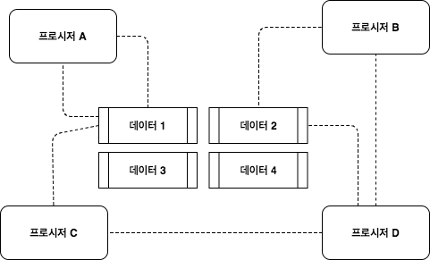

## 객체 지향 입문

> 인프런 강의


### 절차지향



- 프로시저와 데이터간의 접근이 자유롭다
- 시간이 지날수록 프로시저가 어느 데이터든 접근 할 수 있어 캡슐화가 저하되기 때문에 개발이 어려워진다 (유지 보수가 어렵다)

- 디버깅이 어렵다
- 실행속도는 빠름


### 객체 지향


- 실제 세계를 모델링하여 소프트웨어를 개발하며 데이터 프로시저를 알맞게 묶는 게 어려워 처음에는 어렵지만 시간이 흘러갈 수 록 캡슐화의 이점 때문에 유지보수에 매우 좋다


### 캡슐화

- 객체가 기능을 어떻게 구현했는지 외부에 감춘다
  - 정보 은닉의 의미도 포함됨
- 외부에 영향 없이 객체 내부 구현 변경 가능
  - 기능의 구현은 외부에 감추고 기능을 사용한 코드에 영향을 주지 않고 내부 구현을 변경할 수 있는 유연함

#### Tell, Don't Ask

```java
if(acc.getMemberShip() == REGULAR){...}
//acc 객체에게 MemberShip을 묻고 있다
```

Demeter's Law

- 메서드에서 생성한 객체의 메서드만 호출
- 파라미터로 받은 객체의 메서드만 호출
- 필드로 참조하는 객체의 메서드만 호출

```java
acc.getExpDate().isAfter(now) // 안티
acc.isExpired(now) // 적절

Date date = acc.getExpDate;
data.isAfter(now); // 안티
acc.isValid(now); // 적절
```


### 다형성

- 여러 모습을 갖는것

- 객체 지향에서는 한 객체가 여러 타입을 갖는 것
  - 즉 한 객체가 여러 타입의 기능을 제공
  - 타입 상속으로 다형성 구현 (하위 타입은 상위 타입도 됨)
- Override vs Overload
  - Override : 메서드 재정의
  - Overload : 파라미터가 다른 메서드 정의


### 추상화

- 데이터나 프로세스 등을 의미가 비슷한 개념이나 의미 있는 표현으로 정의하는 과정
- 두 가지 방식의 추상화
  - 특성한 성질, 공통 설징(일반회)
- 간단한 예
  - DB의 User 테이블 : 아이디, 이름, 이메일
  - Money 클래스 : 통화, 금액
  - 프린터 : HP MXXXX, 삼성 SL-M2XXX
  - GPU: 지포스, 라데온


- 여러 구현 클래스를 대표하는 상위 타입 도출
- 흔히 인터페이스 타입으로 추상화
- 추상화 타입과 구현 타입 상속으로 연결

### 추상화는 의존 대상이 변경하는 시점에

- 추상화 -> 추상 타입 증가 -> 복잡도 증가
  - 아직 존재하지 않은 기능에 대한 이른 추상화는 주의 : 잘못된 추상화 가능성, 복잡도만 증가
  - 실제 변경, 확장이 발생 할때 추상화


