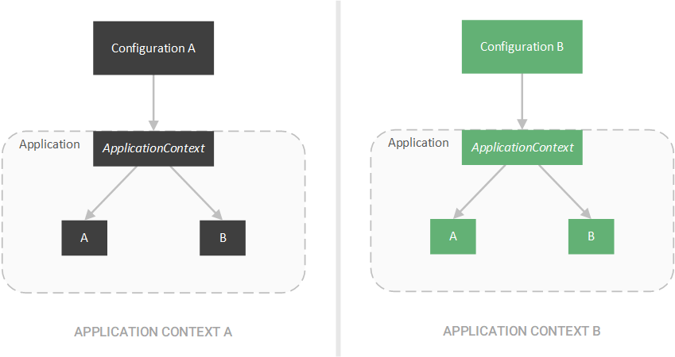

## Spring Design Pattern

1. Singleton pattern
2. Factory Method pattern
3. Proxy pattern
4. Template pattern


### Singleton Pattern

애플리케이션에 오직 한개의 인스턴스가 존재하는 메커니즘

- 공유된 자원이나 로깅같은 cross cutting 서비스에 유용하다

1. Singleton Bean

   - Spring에서 싱글톤은 Application이 아닌 I**oC 컨테이너 당** 하나의 객체로 제한

   

2. Autowired Singletons

   하나의 애플리케이션 컨텍스트에 존재하는 2개이상의 컨테이너를 생성하여 같은 타임의 빈을 주입할 수 있다.

   ```java
   @RestController
   public class LibraryController {
        
       @Autowired
       private BookRepository repository;
    
       @GetMapping("/count")
       public Long findCount() {
           System.out.println(repository);
           return repository.count();
       }
   }
   ```

   ```java
   @RestController
   public class BookController {
         
       @Autowired
       private BookRepository repository;
     
       @GetMapping("/book/{id}")
       public Book findById(@PathVariable long id) {
           System.out.println(repository);
           return repository.findById(id).get();
       }
   }
   ```

   - 이 때 repository 객체의 값은 동일하다 -> 동일한 Bean을 주입했음

     ```java
     com.baeldung.spring.patterns.singleton.BookRepository@3ea9524f
     com.baeldung.spring.patterns.singleton.BookRepository@3ea9524f
     ```

   - `Scope(ConfigurableBeanFactory.SCOPE_PROTOTYPE)` 을 사용하면 Bean을 프로토타입으로 변경하여 **개별 인스턴스**로 작성할 수 있게 함

### Factory Method Pattern


1. Application Context

   - 스프링은 이 기술은 DI 프레임워크의 root에서 사용함
   - 스프링은 Bean을 생산하는 공장으로써 Bean Container로 취급한다
   - 결론, BeanFactory interface를 Bean Container의 추상화로 정의함

   ```java
   public interface BeanFactory {
    
       getBean(Class<T> requiredType);
       getBean(Class<T> requiredType, Object... args);
       getBean(String name);
    
       // ...
   }
   ```

   - getBean 메소드는 factory 메서드임 -> bean의 type과 이름같이 메소드에 제공된 기준과 일치하는 Bean으로 리턴함.

   - 그 후 ApplicationContext인터페이스로 BeanFactory를 확장 하여 추가적인 Application Configuration을 도입한다. 이 Configuartion을 사용하여 XML이나 JAVA 어노테이션 같은 외부 configuration을 기반으로 Bean 컨테이너를 시작한다.

   - ApplicationContext Using the *ApplicationContext* class implementations like *AnnotationConfigApplicationContext*, we can then create beans through the various factory methods inherited from the *BeanFactory* interface.

     - 간단한 application configuration 생성

       ```java
       @Configuration
       @ComponentScan(basePackageClasses = ApplicationConfig.class)
       public class ApplicationConfig {
       }
       ```

     - Foo 객체 생성

       ```java
       @Component
       public class Foo {
       }
       ```

     - Bar 객체 생성 

       ```java
       @Component
       @Scope(ConfigurableBeanFactory.SCOPE_PROTOTYPE)
       public class Bar {
         
           private String name;
             
           public Bar(String name) {
               this.name = name;
           }
             
           // Getter ...
       }
       ```

     - 마지막으로 ApplicationContext의 AnnotationConfigApplicationContext 구현을 통해 빈을 생성

       ```java
       @Test
       public void whenGetSimpleBean_thenReturnConstructedBean() {
            
           ApplicationContext context = new AnnotationConfigApplicationContext(ApplicationConfig.class);
            
           Foo foo = context.getBean(Foo.class);
            
           assertNotNull(foo);
       }
        
       @Test
       public void whenGetPrototypeBean_thenReturnConstructedBean() {
            
           String expectedName = "Some name";
           ApplicationContext context = new AnnotationConfigApplicationContext(ApplicationConfig.class);
            
           Bar bar = context.getBean(Bar.class, expectedName);
            
           assertNotNull(bar);
           assertThat(bar.getName(), is(expectedName));
       }
       ```

       getBean 팩토리 메서드를 사용하므로써 단지 클래스 타입과 생성자 파라미터(Bar) 를 통해 configured bean을 생성할 수 있다

2. External Configuration

   이 패턴은 외부 configuration 기반으로 된 애플리케이션의 행동을 완전히 변화시킬 수 있기 때문에 매우 변하기 쉽다

   만악 우리가 애플리케이션에 autowired된 객체의 구현을 변경하기 바란다면 우리는 우리가 사용하는 ApplicationContext 구현체를 조절할 수 있다

   

   예를 들면 우리는 AnnoationConfigApplicationContext를 ClassPathXmlApplicationContext같은 XML 기반 configuration 클래스로 변경할 수 있다.

   ```java
   @Test
   public void givenXmlConfiguration_whenGetPrototypeBean_thenReturnConstructedBean() { 
    
       String expectedName = "Some name";
       ApplicationContext context = new ClassPathXmlApplicationContext("context.xml");
     
       // Same test as before ...
   }
   ```

   

### Proxy Pattern

>  **the [proxy pattern](https://www.baeldung.com/java-proxy-pattern) is a technique that allows one object — the proxy — to control access to another object — the subject or service**.

프록시 패턴은 한 개체 (프록시)가 다른 개체 (주체 또는 서비스)에 대한 액세스를 제어 할 수있게하는 기술입니다.


1. Transactions

   프록시를 만들기 위해 주제와 동일한 인터페이스를 구현하고 주제에 대한 참조를 포함하는 객체를 만듭니다. Spring에서 Bean은 기본 Bean에 대한 액세스를 제어하도록 프록시됩니다. 트랜잭션을 사용할 때 이 접근 방식을 봅니다.

   ```java
   @Service
   public class BookManager {
        
       @Autowired
       private BookRepository repository;
    
       @Transactional
       public Book create(String author) {
           System.out.println(repository.getClass().getName());
           return repository.create(author);
       }
   }
   ```

   `@Transactional` 어노테이션을 사용함. 이 어노테이션은 스프링에게 **원자성**있게 메서드를 실행하도록 함. 

2. CGLib Proxies

   **Spring creates a proxy that wraps our *BookRepository* bean** and instruments our bean to execute our *create* method atomically

   ```
   com.baeldung.patterns.proxy.BookRepository$$EnhancerBySpringCGLIB$$3dc2b55c
   ```

   BookRepository object ID 와 EnhancerBySpringCGLIB object ID

   

   스프링이 사용하는 두가지 프록시

   - CGLib Proxies - Used when proxying classes
   - JDK Dynamic Proxies - Used when Proxying interfaces


### Template Method Pattern

> Template Method Pattern : https://www.baeldung.com/java-template-method-pattern

DB에 query를 실행 할 때 연결 -> query -> 실행 마무리 -> 연결 끊기 순으로 실행한다. 이러한 시나리오가 Template Method Pattern에 적합하다


1. Templates & Callbacks

   > **The template method pattern is a technique that defines the steps required for some action, implementing the boilerplate steps, and leaving the customizable steps as abstract**

   템플릿 방법 패턴은 일부 작업에 필요한 단계를 정의하고, 상용구 단계를 구현하고, 사용자 정의 가능한 단계를 추상으로 남겨 두는 기술입니다. 서브 클래스는이 추상 클래스를 구현하고 누락 된 단계에 대한 구체적인 구현을 제공 할 수 있습니다.

   ```java
   public abstract DatabaseQuery {
    
       public void execute() {
           Connection connection = createConnection();
           executeQuery(connection);
           closeConnection(connection);
       } 
    
       protected Connection createConnection() {
           // Connect to database...
       }
    
       protected void closeConnection(Connection connection) {
           // Close connection...
       }
    
       protected abstract void executeQuery(Connection connection);
   }
   ```

   callbakc으로 통해 놓친 부분을 채울 수 있다. 콜백 메소드는 대상이 클라이언트에게 원하는 조치가 완료되었음을 알리는 메소드입니다.

   

   executeQuery 메소드를 사용하는 대신 execute 메소드에 쿼리 문자열 및 콜백 메소드를 제공하여 결과를 처리 할 수 있습니다.

   ```java
   public interface ResultsMapper<T> {
       public T map(Results results);
   }
   ```

   ```java
   public abstract DatabaseQuery {
    
       public <T> T execute(String query, ResultsMapper<T> mapper) {
           Connection connection = createConnection();
           Results results = executeQuery(connection, query);
           closeConnection(connection);
           return mapper.map(results);
       ]
    
       protected Results executeQuery(Connection connection, String query) {
           // Perform query...
       }
   }
   ```

2. JdbcTemplate

   JdbcTemplate 클래스는 query 와 ResultSetExtractor 객체를 가짐

   ```java
   public class JdbcTemplate {
    
       public <T> T query(final String sql, final ResultSetExtractor<T> rse) throws DataAccessException {
           // Execute query...
       }
    
       // Other methods...
   }
   ```

   ```java
   @FunctionalInterface
   public interface ResultSetExtractor<T> {
       T extractData(ResultSet rs) throws SQLException, DataAccessException;
   }
   ```

   Spring은 보다 구체적인 콜백 인터페이스를 생성하여 boilerplate 코드를 더욱 줄입니다.

   ```java
   @FunctionalInterface
   public interface RowMapper<T> {
       T mapRow(ResultSet rs, int rowNum) throws SQLException;
   }
   ```

   예상되는 ResultSetExtractor에 RowMapper 인터페이스를 적용하기 위해 Spring은 RowMapperResultSetExtractor 클래스를 작성합니다.

   ```java
   public class JdbcTemplate {
    
       public <T> List<T> query(String sql, RowMapper<T> rowMapper) throws DataAccessException {
           return result(query(sql, new RowMapperResultSetExtractor<>(rowMapper)));
       }
    
       // Other methods...
   }
   ```

   Instead of providing logic for converting an entire *ResultSet* object, including iteration over the rows, we can provide logic for how to convert a single row

   ```java
   public class BookRowMapper implements RowMapper<Book> {
    
       @Override
       public Book mapRow(ResultSet rs, int rowNum) throws SQLException {
    
           Book book = new Book();
            
           book.setId(rs.getLong("id"));
           book.setTitle(rs.getString("title"));
           book.setAuthor(rs.getString("author"));
            
           return book;
       }
   }
   ```

   ```java
   JdbcTemplate template = // create template...
   template.query("SELECT * FROM books", new BookRowMapper());
   ```

   