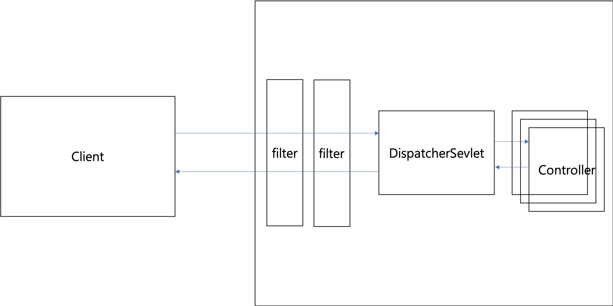

## TaskAgile 개발 전 스프링 공부

### 제어의 역전(IoC)과 의존성 주입(DI)

자바에서 객체의 의존성을 관리하는 방법

- 객체들의 생성자를 호출하여 의존성을 인스턴스화하는 것

  ```java
  public class Service{
    private Sender sender;
    
   	public Service(){
      //의존하는 객체를 인스턴스화
      this.sender = new Sender();
    }
  }
  ```

- 룩업(look-up)패턴을 활용해 의존성들을 찾아 배치하는 것

  ```java
  public class Service{
    private Sender sender;
    
   	public Service(Sender sender){
      this.sender = sender;
    }
  }
  ```

  - 생성자 인자를 통해 인스턴스를 추가한다. 이 방법을 통해서 Service객체가 의존성 제어를 하지 못한다. **제어의 역전**


### 어노테이션 

> 빈을 설정하는 어노테이션
>
> 의존성을 연결하는 어노테이션

`@Component`, `@Service`, `@Repository`, `@Controller` -  빈으로 등록된다.

빈으로 등록된 객체들은 `@ComponentScan`을 통해서 스캔(기존 패키지 기준으로)된다.


**의존성 주입**

- 생성자 기반 주입

  ```java
  @Autowired
  public Service(Repository repository){
    this.repository = repository;
  }
  ```

- 세터 기반/메소드 기반의 주입

  ```java
  public class Serivce{
    @Required
    public void setRepository(Repository repository){
      this.repository = repository;
    }
  }
  ```

  - `@Autowired`나 `@Required` 어노테이션으로 사용

- 필드 기반의 주입

  ```java
  @Autowired
  private Repository repository;
  ```

#### 무슨 주입을 사용할까용?

- 반드시 **필요한 의존성은 항상 생성자를 통해 주입**한다.
  - 생성 이휴 주입됩 의존성은 **Read-Only**이며, 수정할 수 없다.
- 선택일 경우 세터/메소드를 통해 주입

- 필드는 사용하지 마라
  - 너무 많은 의존성을 추가하면 단일 책임 원칙(SRP)을 위한하기 때문


### Spring MVC

**Java EE Servlet (Servlet)** 

1. HTTP 요청이 서버에 도착하면 인증, 로깅, 감사 등 필터링 작업을 수행하는 필터 리스트를 통하한다

2. 일치하는 URI에 등록된 서블릿으로 요청을 넘긴다
3. HttpServletRequest, HttpSession, HttpServletResponse


- 서블릿을 사용할 때 in-memory 데이터나 I/O 수행과 같은 공유 리소스에 접근시 항상 동시 요청을 다루고, **하나의 요청에 의한 변경 사항이 다른 요청에 영향**을 줄 수 있다.


**DispatcherServlet**

- 스프링는 DispatcherServlet를 사용한다. 이는 `@RequestMapping`어노테이션에 지정된 URI에 따라 컨트롤러를 지정해준다.




### 핕어

- 책인 연쇄 피턴(Chain of Responsibility)

```java
public class AuditingFilter extends GenericFilterBean{
  @Override
  public void doFilter(ServletRequest req, SevletResponse res, FilterChain chain) throws IOException, ServletException {
    long start = new Date().getTime();
    chain.doFilter(req, res); 
    long elapsed = new Date().getTime() - start; //다른 필터를 호출해도 추가 작업을 수행할 수 있다
    HttpServletRequest request = (HttpServletRequest) req;
    logger.debug(...);
  }
}
```

- Spring에서 필터를 등록할 때 방법 두가지

  - Web.xml에 \<filter> 와 \<filter-mapping>을 추가한다

  - FilterRegistrationBean

    ```java
    @Bean
    public FilterRegistrationBean<AuditingFilter> auditingFilterRegistrationBean(){
      FilterRegistrationBean<AuditingFilter> registration = new FilterRegistrationBean();
      AuditingFilter filter = new AuditingFilter();
      registration.setFilter(filter);
      registration.setOrder(Integer.MAX_VALUE); //순서
      registration.setUrlPatterns("/messages/*"); // /messages/로 시작하는 경로에만 요청 처리
      return registration;
    }
    ```


### Spring AOP

**Aspects**

- ClassA, ClassB, ClassC에서 실행하는 메소드에서 중복된 메소드를 실행할 경우

  ```java
  public classA{
    public void methodA(){
      check();
    }
  }
  public classB{
    public void methodB(){
      check();
    }
  }
  ...
  ```

  중복되는 코드가 발생한다.

- AOP 사용할 경우

  ```java
  @Aspect
  @Component
  public class Checker(){
    @Around("execution(* app.message..*.*{...})") //app.message 패키지 내의 모든 클래스의 메소드가 실행될 때마다
    public Object check(ProceeingJoinPoint jointPoint){
      ...
    }
  }
  ```

  ClassA, ClassB .. 메소드에 check() 메소드를 명시하지 않아도 된다. -> 중복 제거 할 수 있음.

- 어노테이션으로 만들기

  ```java
  @Target(ElemtType.METHOD)
  @Retention(RetentionPolicy.Runtime)
  public @interface Check{}
  ```

  ```java
  @Aspect
  @Component
  public class SecurityChecker{
    @Pointcut("annotation(Check)")
    public void checkMethod(){}
    
    @Around("checkMethod")
    public Object check(ProceedingJointPoint joinPoint) throws Throwable {
      ...
    }
  }
  ```


