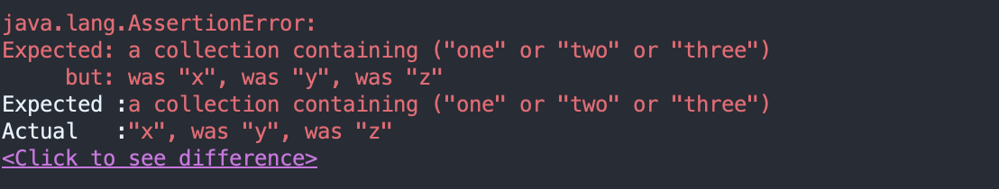
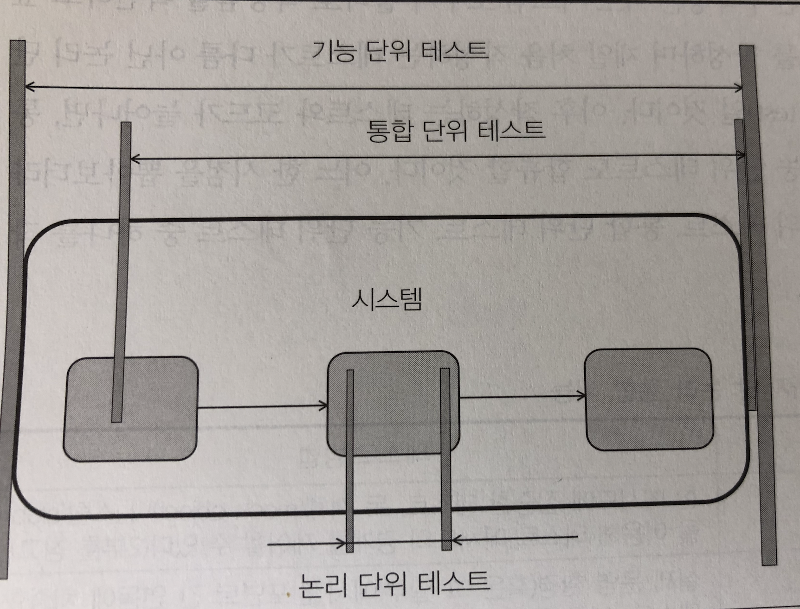
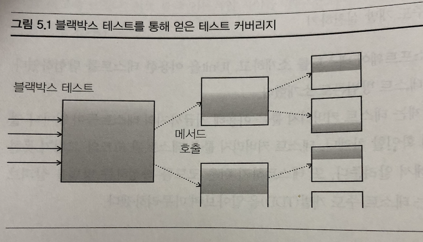
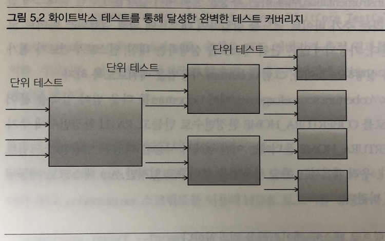
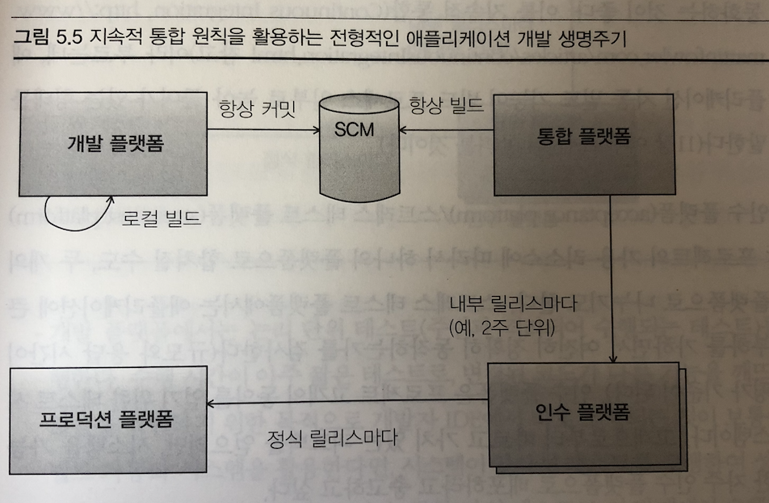
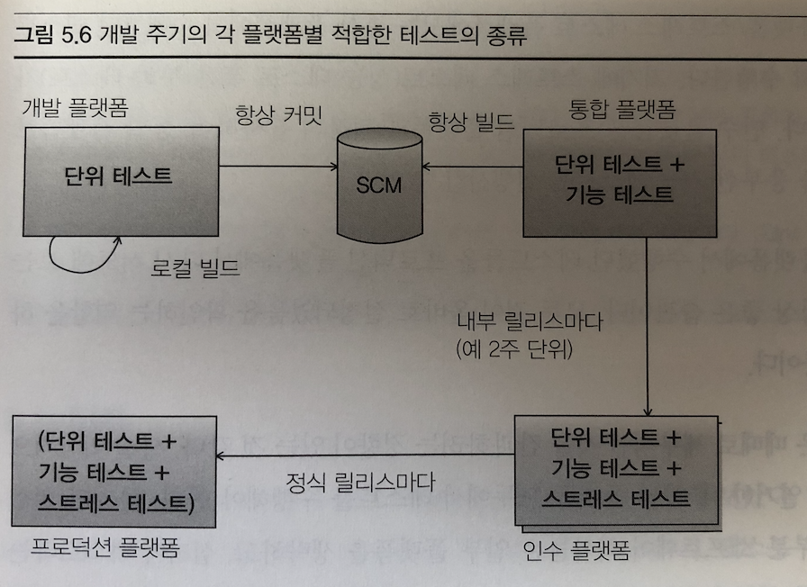

## 책 제목 : JUnit in Action

참고 도서 : [JUnit in Action](https://www.aladin.co.kr/shop/wproduct.aspx?ItemId=12075966)


### 목차

- [01-Intro](#01Intro)
- [02-JUnit핵심](#02Junit-핵심)
- [03-JUnit마스터하기](#03JUnit-마스터하기)
- [04-소프트웨어 테스트 원칙](#04소프트웨어-테스트-원칙)
- [05-테스트 커버리지와 개발](#05테스트-커버리지와-개발)
- [06-스텀을 활용한 포괄적인 테스트](#06스텀을-활용한-포괄적인-테스트)


---

### 01.Intro

- 단위 테스트 : 명확한 작업 단위의 동작을 검사
- 통합 테스트나 인수 테스트는 다양한 컴포넌트 사이의 상호작용을 검증


```java
public class Calculator {
    public double add(double a, double b) {
        return a + b;
    }
}
```

- 문제가 있을까?
  - add 연산은 아무리 단순해도 프로그램의 기능임 -> 간접적으로 다른 메서드에게 영향을 줄 수 있음.
  - 애플리케이션이 수정될 때마다 기능의 동작 여부를 체크할 필요가 있음.


#### 단위 테스트 프레임 워크

규칙

1. 단위 테스트는 다른 모든 단위 테스트들과 **독릭적으로** 실행
2. 테스트 각각의 오류를 식별하고 보고해야함
3. 어떤 테스트를 실행할지 선택하기 쉬워야함


#### JUnit의 설계 목표

- 유용한 테스트를 작성하는 데 보탬이 되어야함
- **시간이 지나도 가치가 변치 않는 테스트**를 작성하는 데 보탬이 되어야 함
- 코드 재사용을 통해 테스트 작성 비용을 낮추는 데 보탬이 되어야 함


Junit을 적용한 Calculator Test

```java
public class CalculatorTest {

    @Test
    public void testAdd() {
        Calculator calculator = new Calculator();
        double result = calculator.add(10, 50);
        assertEquals(60, result, 0);//허용 오차
    }
}
```

- 테스트 메서드는 test_명으로 작성 권장

- assertEquals 

  ```java
  static public void assertEquals(double expected, double actual, double delta)//delta = 오차 범위
  ```


### 02.Junit 핵심

테스트 메서드 조건

- `@Test` 에노테이션 부여
- public 메서드
- void 반환형 메서드


Junit이 `@Test` 메서드를 호출 -> 독립된 메모리 공간에서 실행 

- Why? 혹시 모를 부작용을 방지


다양한 assert 메서드들

|   Assert 메서드    |               목적                |
| :----------------: | :-------------------------------: |
| assertArraysEquals |          배열 일치 여부           |
|    assertEquals    |   객체 일치 여부(equals로 판단)   |
|     assertSame     | 동일한 객체인가 (하나의 객체인가) |
|     assertTrue     |               True                |
|   assertNotNull    |             not null              |


- 테스트 클래스 - @Test가 부여된 테스트를 하나 이상 포함한 클래스
- 스위트 - 테스트들의 집합. 
- 러너 - 테스트 스위트 실행 엔진. 


#### 파라미터화 테스트 실행

하나의 테스트를 여러 번 반복 실행하는 기능

```java
@RunWith(value = Parameterized.class)
public class ParameterizedTest {

    private double expected;
    private double valueOne;
    private double valueTwo;

    @Parameters
    public static Collection<Integer[]> getTestParameters() {
        return Arrays.asList(new Integer[][]{
            {2, 1, 1},
            {3, 2, 1},
            {4, 3, 1}
        });
    }

    public ParameterizedTest(double expected, double valueOne, double valueTwo) {
        this.expected = expected;
        this.valueOne = valueOne;
        this.valueTwo = valueTwo;
    }

    @Test
    public void sum() {
        Calculator calc = new Calculator();
        assertEquals(expected, calc.add(valueOne, valueTwo), 0);
    }

}
```

- `@RunWith(value = Parameterized.class)`  -> `@Parameters` 를 가진 메서드 필요 -> 파라미터로 받을 생성자 필요함 -> test 실행


### 03.JUnit 마스터하기

#### 예제를 통한 애플리케이션 구현

1. 인터페이스 설계

   ```java
   public interface Request {
       String getName();
   }
   
   public interface Response {
   
   }
   
   public interface RequestHandler {
   
       Response process(Request request) throws Exception;
   }
   
   public interface Controller {
   
       Response processRequest(Request request);
   
       void addHandler(Request request, RequestHandler requestHandler);
   }
   ```

   - RequestHandler : 궃은 일을 도맡아 처리해주는 목적

     > 제어 구조 역전
     >
     > 이벤트가 발생했을 때 처리할 핸들러 객체를 등록해두고, 그 이벤트가 발생하면 등록되어 있던 객체의 특정 메서드를 호출하는 방식.
     >
     > 제어 구조의 역전을 통해 개발자들은 프레임워크가 관리하는 이벤트 생명주기에 대해 신경쓸 필요 없이 원하는 이벤트 처리를 위한 자기만의 핸들러를 끼워 넣을 수 있음.

2. 기반 클래스  구현

   ```java
   public class DefaultController implements Controller {
   
       private Map requestHandlers = new HashMap();
   
       protected RequestHandler getHandler(Request request) {
           if (!this.requestHandlers.containsKey(request.getName())) {
               String message = "Cannot find handler for request name " + "[" + request.getName() + "]";
               throw new RuntimeException(message);
           }
           return (RequestHandler) this.requestHandlers.get(request.getName());
       }
   
       @Override
       public Response processRequest(Request request) {
           Response response;
           try {
               response = getHandler(request).process(request);
           } catch (Exception e) {
               response = new ErrorResponse(request, e);
           }
           return response;
       }
   
       @Override
       public void addHandler(Request request, RequestHandler requestHandler) {
           if (this.requestHandlers.containsKey(request.getName())) {
               throw new RuntimeException(
                   "A request handler has already been registred for request name [" + request.getName() + "]");
           } else {
               this.requestHandlers.put(request.getName(), requestHandler);
           }
       }
   }
   ```

   - 요청에 대한 핸들러 반환을 위한 `getHandler()` 구현
   - 요청에 적절한 핸들러 전달 후 응답값 반환 하는 `processRequest()` 구현

3. 컨트롤러 테스트

   ```java
   private DefaultController controller;
   
   @Before
   public void instantiate() throws Exception {
       controller = new DefaultController();
   }
   ```

   - `@Before` 테스트 메서드 사이에서 호출 됨. (테스트 후 `@After`)
     - 테스트 메서드를 합치지 않고  테스트 사이에서 픽스쳐를 공유할 수 있도록 하기 위함.

4. 핸들러 추가하기

   RequestHandler가 작동하는 지 테스트

   ```java
   private class SampleRequest implements Request {
   
       public String getName() {
           return "test";
       }
   }
   
   private class SampleHandler implements RequestHandler {
   
       @Override
       public Response process(Request request) throws Exception {
           return new SampleResponse();
       }
   }
   
   private class SampleResponse implements Response {
   }
   ```

   - 요청 응답 핸들러에 대한 객체를 만든다 (inner 객체)

   ```java
   @Test
   public void testAddHandler() {
     Request request = new SampleRequest();
     RequestHandler = new SampleHandler();
     controller.addHandler(request, handler);
     RequestHandler handler = controller.getHandler(request);
     assertSame("Handler we set in controller should be the same requestHandler we get", handler, requestHandler);
   }
   ```

   - request, handler를 생성 후 request 요청시 같은 핸들러 인지 테스트

   1. 정해진 상태로 테스트를 초기화
   2. 테스트 대상 메서드 호출
   3. 결과를 확인

5. 요청 처리하기

   ```java
   @Test
   public void testProcessRequest() {
      	Request request = new SampleRequest();
     	RequestHandler = new SampleHandler();
     	controller.addHandler(request, handler);
       Response response = controller.processRequest(request);
       assertNotNull("Must not return a null response", response);
       assertEquals(new SampleResponse(), response);
   }
   ```

   - 반환된 response null 체크하기

   상태 초기화 중복 제거

   ```java
      	Request request = new SampleRequest();
     	RequestHandler = new SampleHandler();
     	controller.addHandler(request, handler);
   ```

   ->객체 인스턴스로 초기화

   ```java
   @Before
       public void instantiate() throws Exception {
           controller = new DefaultController();
           request = new SampleRequest();
           requestHandler = new SampleHandler();
           controller.addHandler(request, requestHandler);
   
       }
   ```

6. testProcessRequest 개선하기

   ```java
   private class SampleResponse implements Response {
   
           private static final String NAME = "Test";
   
           public String getName() {
               return NAME;
           }
   
           public boolean equals(Object object) {
               boolean result = false;
               if (object instanceof SampleResponse) {
                   result = ((SampleResponse) object).getName().equals(getName());
               }
               return result;
           }
   
           public int hashCode() {
               return NAME.hashCode();
           }
       }
   ```

   - equals 구현후 assertEquals 적용하기

7. 예외 처리 테스트 하기

   ```java
       @Test(expected = RuntimeException.class)
       public void testGetHandlerNotDefined() {
           SampleRequest request = new SampleRequest("restNotDefined");
   
           controller.getHandler(request);
       }
   
       @Test(expected = RuntimeException.class)
       public void testAddRequestDuplicateName() {
           SampleRequest request = new SampleRequest();
           SampleHandler handler = new SampleHandler();
   
           controller.addHandler(request, handler);
       }
   ```

   > 예외 테스트도 읽기 쉽게 말들어라 + 가능한 모든 예외를 테스트하라
   >
   > expected 파라미터만으로도 개발자가 발생시키려는 예외가 무엇인지 명백히 해야함

8. 타임아웃 테스트

   ```java
       @Test(timeout = 130)
       @Ignore(value = "Ignore for now util we decided a decent time-limit")
       public void testProcessMultipleRequestsTimeout() {
           Request request;
           Response response = new SampleResponse();
           RequestHandler handler = new SampleHandler();
           for (int i = 0; i < 99999; i++) {
               request = new SampleRequest(String.valueOf(i));
               controller.addHandler(request, handler);
               response = controller.processRequest(request);
               assertNotNull(response);
               assertNotSame(ErrorResponse.class, response.getClass());
           }
       }
   ```

   - timeout = 130 : 130밀리초 
   - `@Ignore` 테스트를 건너 뛸때 - 반드시 이유를 명시해라!!


#### Hamcrest 라이브러리

```java
public class HamcrestTest {

    private List<String> values;

    @Before
    public void setUpList() {
        values = new ArrayList<String>();
        values.add("x");
        values.add("y");
        values.add("z");
    }

    @Test
    public void testWithoutHamcrest() {
        assertTrue(values.contains("one") || values.contains("two") || values.contains("three"));

    }

    @Test
    public void testWithHamcrest() {
        assertThat(values, hasItem(anyOf(equalTo("one"), equalTo("two"), equalTo("three"))));
    }

    //error 설명이 더 자세할 뿐만 아니라 코드 자체의 가독성이 뛰어남.
}
```

- 직관적이여서 보고 사용하는 데 쉽다.
- assert 실패시 설명이 디테일 함.




### 04.소프트웨어 테스트 원칙

#### 단위 테스트가 필요한 이유

- 기능 테스트보다 훨씬 높은 커버리지 달성이 가능하다
- 팀 생산성 향상
  - 단위 테스트를 통해 다른 컴포넌트가 완료될 때까지 기다지리 않아도 됨
  - 기능 테스트는 정밀한 테스트를 하지 못하고, 전체 애플리케이션이 준비되어 있어야함
- 회귀 테스트를 수행하고 디버깅의 필요성을 줄여줌
- 리팩터링과 코드 수정시 확신을 줌
- 구현 품질 향상
- 기대하는 행위를 문서화
- 코드 커비리지 등 각종 측정이 가능
  - Unit < Integration < Functional < Stress/load < Acceptance Testing


#### 테스트의 종류

- 통합 테스트

  - 여러 컴포넌트에 의해 함께 사용되는 빈도가 높은 부분은 버그 발생 확률이 높아짐

  - 코드 작성 전에 통합 테스트를 정의해야함

    |      상호작용 유형      |                         테스트 방법                          |
    | :---------------------: | :----------------------------------------------------------: |
    |    객체 간 상호작용     |  테스트는 객체들을 생성하고, 객체에 정의된 메서드들을 호출   |
    |   서비스 간 상호작용    | 서블릿이나 EJB 컨테이너가 애플리케이션을 구동하는 과정에서 실행된다. 서블릿이나 EJB 컨테이너는 데이터베이스에 연결되거나, 필요한 여타의 외부 자원이나 기기를 사용할 수 있다. |
    | 서브 시스템 간 상호작용 | 계층적 애플리케이션은 표현 계층을 담당하는 프론트엔드와 비즈니스 로직을 실행하는 백엔드로 구성됨. 프론트로부터 요청이 잘 전될되어 백엔드가 적절히 응답하는지 검사 |

- 기능 테스트

  - API 가장 바깥쪽에 해당하는 코드를 검사

  - 로그인을 하지 않으면 로그인 페이지(login)로 redirect

    - HTTP 요청 응답값으로 302 확인

    |          애플리케이션 유형          |                       기능 테스트 방법                       |
    | :---------------------------------: | :----------------------------------------------------------: |
    | 프레임워크를 이용하는 애플리케이션  |    프레임워크의 기능테스트는 프레임워크 API 테스트에 집중    |
    |     GUI를 포함하는 애플리케이션     |    모든 기능을 사용할 수 있고 기대한 대로 동장하는지 검증    |
    | 서브 시스템들로 구성된 애플리케이션 | 각 계층이 다른 계층에서 사용할 수 있도록 API를 제공하는 데 이것을 검사 |

- 스트레스 테스트

  - 동시다발적으로 사용할 때 얼마나 잘 버티는 가?
  - JMeter 같은 소프트웨어 사용하여 처리량을 측정
  - 성능 테스트가 선행되어야함. 또한 테스트 환경을 최대한 실제 운영환경에 맞게함.

- 인수 테스트

  - 테스트 중 마지막 단계
  - 고객과 이해관계자가 정의한 모든 목적에 부합하는지 확인


#### 단위테스트 종류

| 테스트 유형      | 테스트 방법                                                  |
| ---------------- | ------------------------------------------------------------ |
| 논리 단위 테스트 | 한 메서드에 집중한 테스트                                    |
| 통합 단위 테스트 | 컴포넌트 간 연동에 치중한 테스트 ex) 데이터베이스를 사용하는 코드라면 데이터베이스를 효과적으로 호출하는가를 테스트 |
| 기능 단위 테스트 | 자극 반응을 확인하기 위해 통합 단위 테스트의 경계를 확장한 테스트 ex) 비 로그인 후 접근 302 응답 |



#### 블랙박스 테스트와 화이트 박스 테스트

- 블랙박스 테스트 : 수동으로 사용자 인터페이스를 조작
- 화이트박스 테스트 : 재발자가 직접 구현하며 구현에대한 상세한 지식을 모두 활용

사용자 중심 접근법

테스트 난이도

- 블랙 박스 테스트 - 난해함
- 화이트박스 테스트 - 용이함 하지만 개발자가 직접 구현해야함

테스트 커버리지

- 블랙 박스 테스트 - 낮음
- 화이트박스 테스트 - 높음


### 05.테스트 커버리지와 개발

#### 테스트 커버리지 측정하기

테스트 커버리지란?

- 블랙박스 - 테스트에 의해 호출된 메서드들을 추적해 보여주는 방식

  

- 화이트박스 - 단위 메서드 구현에 대한 자세한 지식을 활용해 단위 테스트를 작성함. 조건 분기가 하나 포함된 메서드라면 각 분기별 하나씩 단위 테스트를 마련 -> 메서드 내부를 들여다 봐야함

  

  

테스트 커버리지 측정을 위한 라이브러리 Cobertura


#### 테스트 가능한 코드 작성하기

- 공개 API는 계약이다

  - 공개 메서드의 시그니처를 변경 하면 이를 호출하는 모든 코드와 테스트가 수정되야함
  - 공개 메서드는 반드시 테스트를 해야한다

- 종속성을 줄여라

  - 코드에서 객체 생성을 담당하는 메서드와 애플리케이션 로직 수행을 처리하는 메서드를 분리함.

  ```java
  public class Vehicle {
  
      Driver driver = new Driver();
      boolean hasDriver = true;
  
      private void setHasDriver(boolean hasDriver) {
          this.hasDriver = hasDriver;
      }
  
  }
  ```

  - Vehicle 생성시 Driver 객체 생성 -> 종속성

  ```java
  public class Vehicle {
  
      Driver driver;
      boolean hasDriver = true;
  
      Vehicle(Driver driver) {
          this.driver = driver;
      }
  
      private void setHasDriver(boolean hasDriver) {
          this.hasDriver = hasDriver;
      }
  
  }
  ```

  - 생성자를 이용하여 해결

- 생성자는 간단하게 만들어라

  - 테스트하려는 클래스를 생성한다
  - 생성한 클래스를 특정한 상태가 되도록 설정
  - 최종 상태를 확인한다.

  생성자에서 작업 수행시 1, 2번 작업이 섞임 -> 항상 똑같은 상태

- 최소 지식의 원칙을 따르라

  - 객체를 요구하되, 객체를 검색하지 말아라!(get X)

- 숨겨진 종속성과 전역 상태를 피하라

  전역 상태를 사용하는 예

  ```java
  public void reserve(){
      DBManager manager = new DBManager();
      manager.initDatabase();
          
      Reservation reservation = new Reservation();
      reservation.reserve();
  }
  ```

  데이터베이스 매니저가 전역임 -> init이 선행되어야 reservation을 실행할 수 잇음

  개선 후

  ```java
  public void reserve(){
    DBManager manager = new DBManager();
    manager.initDatabase();
    Reservation reservation = new Reservation(manager);
    reservation.reserve();
  }
  ```

  - 전역 상태를 회피하라. 전역 객체에 접근해야 할 때에는, 그 객체뿐 아니라 그 객체가 참고하는 다른 모든 객체도 함께 공유해야한다

  > 모든 클래스가 협력자들이 누구인지 밝히고 있는 사회에 산다고 상상해보자. 조는 매리를 알지만, 매리와 조 모두 팀을 모른다는 것을 알고 있다면, 조에게 알려준 정보는 매리에게는 전달될 수 있지만, 팀은 절대 알 수 없다고 가정해도 안전하다. 이제 모두가 일부의 친구만 공개하고, 다른 친구들은 비밀로 하고 있는 사회를 상상해보자. 그런 사회에서 여러분이 조에게만 알려준 정보를 팀도 알고 있다면, 팀은 대체 어떤 경로로 이를 알게 되었는지 궁금해질 것이다.
  >
  > 만약 여러분이 관계를 만들어낸 사람이라면, 여러분은 모든 종속성을 정확히 알고있지만, 여러분 이후에 합류한 사람들은 당황하게 될 것이다. 친구라고 선언된 사람들만이 유일한 친구도 아닐 뿐더러, 여러분이 알 수 없는 비밀 경로로 정보가 전달되기 때문이다. 거짓으로 가득 찬 사회에 살게 될 것이다.

- 싱글톤의 장단점
  - private 메서드를 직접 호출하거나 테스트할 수 없다
  - 싱글톤은 전역 상태를 만들어 낸다는 취약점이 존재함 사용시 주의
- 제너릭 메서드를 애용하라

- 상속보다 컴포지션을 활용하라
  - 컴포지션 방식은 객체의 상태 변경이나, 테스트에 적합한 코드를 만들어줌
- 조건 분기보다 다형성을 활용하라
  - Switch문이나 if 문을 마주하게 되면 다형성을 고려해보자


#### 테스트 주도 개발

> 자동화 테스트가 실패했을 때와 코드 중복을 제거하려 할 때에만 새로운 코드를 작성하도록 권하는 프로그래밍 실천법

전통적인 개발 주기 : 코딩 - 테스트 - (반복) - 커밋

TDD : 테스트 - 코드 - (반복) - 커밋

1. 새 코드를 작성하기 앞서 실패하는 자동화 테스트를 작성하라.
2. 중복을 제거하라

실패하는 테스트를 먼저 작성하라!

- 실패한 테스트는 테스트가 성공하도록 만들 것임


#### 개발 주기에서의 테스트



- 개발 플랫폼 : 개발자의 컴퓨터에서 이루어지는 코딩
- 통합 플랫폼 : 서로 다른 팀에 의해 만들어진 컴포넌트를 한 곳에 모음
- 인수 플랫폼/스트레스 테스트 플랫폼 
  - 고객의 동의를 얻기 위한 테스트 (인수)
  - 큰 부하를 가하면서 여전히 정확이 동작하는가 (스트레스)
- 프로덕션 플랫폼 : 실제 운영환경




### 06.스텀을 활용한 포괄적인 테스트

> 테스트 대상 코드가 다른 클래스에 종속되어 있는 경우가 발생함
>
> 외부에 의존적인 애플리케이션 테스트에 JUnit을 활용하는 방법을 알아 보자

#### 스텁이란?

스텁 : 실제 코드나 아직 준비되지 못한 코드의 행동으로 가장하는 메커니즘을 뜻함.

> 호출자를 실제 구현물로부터 격리시킬 목적으로 런타임에 실제 코드 대신 삽입되는 코드 조각이다. 보다 복잡한 행위를 단순한 것으로 교체하여 실 코드의 일부를 독립적으로 테스트하기 위한 의도로 사용

- 시스템이 너무 복잡하고 깨지기 쉬워 수정이 불가할 때
- 하부 시스템 간의 통합 테스트처럼 포괄적인 테스트를 수행할 때


#### HTTP 커넥션을 스텁으로 대체하기

```java
public class WebClient {

    public String getContent(URL url) {
        StringBuffer content = new StringBuffer();
        try {
            HttpURLConnection connection = (HttpURLConnection) url.openConnection();
            connection.setDoInput(true);
            InputStream inputStream = connection.getInputStream();
            byte[] buffer = new byte[2048];
            int count;
            while (-1 != (count = inputStream.read(buffer))) {
                content.append(new String(buffer, 0, count));
            }
        } catch (IOException e) {
            return null;
        }
        return content.toString();
    }

}
```

<예제 webclient>

1. 스텁 방식 선택하기
   - Jetty 서버 
     - 사용 이유 : 빠르고, 가볍고, 테스트 케이스에서 프로그램적으로 제어할 수 있다. 뿐만아니라 상용 서비스에서 활용할 수 있는 웹 서버이자 서블릿/JSP 컨테이너이기 때문

2. 임베디스 서버로 Jetty 활용하기

   ```java
   import org.mortbay.jetty.Server;
   import org.mortbay.jetty.handler.ResourceHandler;
   import org.mortbay.jetty.servlet.Context;
   
   public class JettySample {
   
       public static void main(String[] args) throws Exception{
   
           Server server = new Server(8080);
   
           Context root = new Context(server, "/");
           root.setResourceBase("./pom.xml");
           root.setHandler(new ResourceHandler());
   
           server.start();;
       }
   }
   ```

   - jetty dependency 추가해야함


#### 웹 서버의 리소스를 스텁으로 대체하기

```java
public class TestWebClient {

    @BeforeClass
    public static void setUP() throws Exception {
        Server server = new Server(8080);

        TestWebClient t = new TestWebClient();

        Context contentOkContext = new Context(server, "/testGetContentOk");
        contentOkContext.setHandler(t.new TestGetContentOkHandler());

        Context contentNotFoundContext = new Context(server, "/testGetContentNotFound");
        contentNotFoundContext.setHandler(t.new TestGetContentNotFoundHandler());
        server.setStopAtShutdown(true);
        server.start();
    }

    @Test
    public void testGetContentOk() throws Exception {
        WebClient client = new WebClient();
        String result = client.getContent(new URL("http://localhost:8080/testGetContentOk"));
        assertEquals("It works", result);

    }

    @Test
    public void testGetContentNotFound() throws Exception{
        WebClient webClient = new WebClient();
        String result = webClient.getContent(new URL("http://localhost:8080/testGetContentNotFound"));
        assertNull(result);
    }

    @AfterClass
    public static void tearDown() {

    }

    private class TestGetContentOkHandler extends AbstractHandler {

        public void handle(String s, HttpServletRequest httpServletRequest, HttpServletResponse httpServletResponse,
                           int i) throws IOException, ServletException {

            OutputStream out = httpServletResponse.getOutputStream();
            ByteArrayISO8859Writer writer = new ByteArrayISO8859Writer();
            writer.write("It works");
            writer.flush();
            httpServletResponse.setIntHeader(HttpHeaders.CONTENT_LENGTH, writer.size());
            writer.writeTo(out);
            out.flush();
        }
    }

    private class TestGetContentNotFoundHandler extends AbstractHandler {

        public void handle(String s, HttpServletRequest httpServletRequest, HttpServletResponse httpServletResponse,
                           int i) throws IOException, ServletException {
            httpServletResponse.sendError(HttpServletResponse.SC_NOT_FOUND);
        }
    }
}
```

- handler를 만들어 요청에 대한 응답을 전송한다
- 서버를 실행시키고 test를 진행한다
- 실패 조건 Notfound 또한 테스트를 진행한다


커스텀 URL 프로토콜 핸들러 제작하기

```java
public class TestWebClient1 {

    @BeforeClass
    public static void setUp() {
        TestWebClient1 t1 = new TestWebClient1();
        URL.setURLStreamHandlerFactory(t1.new StubStreamHandlerFactory());
    }

    private class StubStreamHandlerFactory implements URLStreamHandlerFactory {

        public URLStreamHandler createURLStreamHandler(String protocol) {
            return new StubHttpURLStreamHandler();
        }
    }

    private class StubHttpURLStreamHandler extends URLStreamHandler {

        protected URLConnection openConnection(URL url) throws IOException {
            return new StubHttpURLConnection(url);
        }
    }

    @Test
    public void testGetContentOk() throws Exception {
        WebClient client = new WebClient();
        String result = client.getContent(new URL("http://localhost"));
        assertEquals("It works", result);
    }
}
```

- setURLStreamHandler Factory를 호출하여 StubStreamHAndlerFactory를 등록한다
- StubStreamHandlerFactory는 createURLStreamHandler 를 오버라이드하여 StubHttpURLStreamHanler를 반환한다
- StubHttpURLStreamHanler는 openConnection 메서드로 URL에 커넥션을 맺도록 한다

