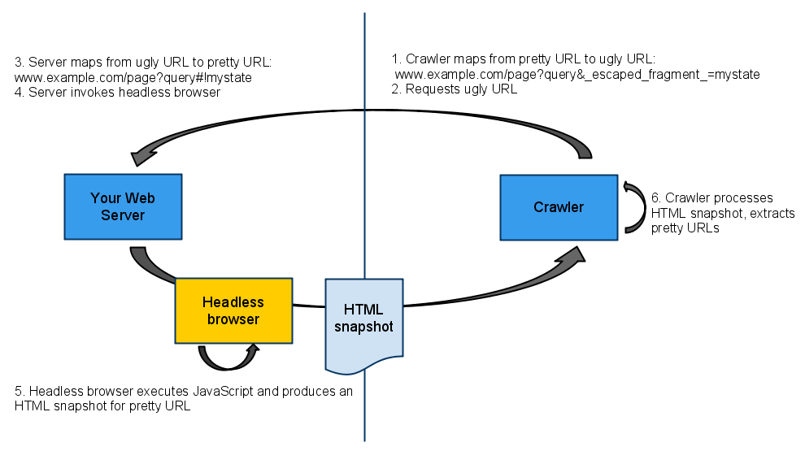

## Client-side rendering vs Server-side rendering

### Performance

Server-side rendering

- 새로운 웹 페이지를 보고 싶을 때마다 새로운 요청이 필요함

  


Client-side rendering

- 슈퍼마켓에 한 번 방문하여 오랜 기간동안 먹을 음식을 구매함

  


Client-side rendering은 초기 페이지 로딩이 매우 **느리다**

- 네트워크를 통한 통신이 느리고 사용자에게 내용을 보여주기 전에 서버로부터 2번 왕복을 하기 때문이다. But, 이후의 페이지 로딩은 매우 빨라진다

Server-side rendering은 초기 페이지 로딩이 느리지 않다

- But, 빠르지도 않다!


Client-side rendering을 사용할 때의 초기 페이지는 다음과 같다

```html
<html>
  <head>
    <script src="client-side-framework.js"></script>
    <script src="app.js"></script>
  </head>
  <body>
    <div class="container"></div>
  </body>
</html>
```

js를 통해 모든 HTML 페이지를 다음과 같이 정의한다

```javascript
var pages = {
  '/': '<html> ... </html>',
  '/foo': '<html> ... </html>',
  '/bar': '<html> ... </html>',
};
```

다른 페이지가 로드되면 프레임워크는 URL 표시줄을 보고 `/`페이지에서 문자열`pages['/']`을 가져와 `<div class = "container"> </ div>`에 삽입한다. 또한 링크를 클릭하면 프레임워크가 이벤트를 가로 채고 컨테이너에 새 문자열을 삽입하고 브라우저가 정상적으로 하는 것처럼 HTTP 요청을 실행하지 못하게 합니다


### 검색 엔진 최적화(SEO)

웹 크롤러가 reddit 홈페이지에 요청을 한다고 가정하자

```javascript
var request = require('request');
request.get('reddit.com', function (error, response, body) {
  // body looks something like this:
  // <html>
  //   <head> ... </head>
  //   <body>
  //     <a href="espn.com">ESPN</a>
  //     <a href="news.ycombinator.com">Hacker News</a>
  //     ... other <a> tags ...
});
```

크롤러는 새 요청을 일으키는 reponse body에 있는 `<a href>`를 사용한다

```javascript
var request = require('request');
request.get('reddit.com', function (error, response, body) {
  // body looks something like this:
  // <html>
  //   <head> ... </head>
  //   <body>
  //     <a href="espn.com">ESPN</a>
  //     <a href="news.ycombinator.com">Hacker News</a>
  //     ... other <a> tags ...
  
  request.get('espn.com', function () { ... });
  request.get('news.ycombinator.com', function () { ... });
});
```

그런 후에 크롤러는 espn과 news.ycombinator의 링크를 이용하여 클로링을 유지할 수 있다

결국 다음과 같은 재귀 코드처럼 동작한다

```javascript
var request = require('request');

function crawlUrl(url) {
  request.get(url, function (error, response, body) {
    var linkUrls = getLinkUrls(body);
    
    linkUrls.forEach(function (linkUrl) {
      crawlUrl(linkUrl);
    });
  });
}

crawlUrl('reddit.com');
```

만약 response body가 다음과 같은 모습이면 무슨일이 일어날까?

```html
<html>
  <head>
    <script src="client-side-framework.js"></script>
    <script src="app.js"></script>
  </head>
  <body>
    <div class="container"></div>
  </body>
</html>
```

위 코드는 `<a href>` 태크가 없다. 또한 이 웹 페이지는 보기 좋다. 그래서 우리는 우리가 검색 결과를 표시할 때 우선순위를 지정하지 않을 것이다

크롤러는 좀처럼 알지 못하지만 Client side 프레임워크는 멋진 콘텐츠들로 `<div class = "container"></div>`를 채우려한다

이것은 왜 cleint-side 렌터링이 SEO에 좋지 않는 가에 대한 이유이다


### Prerendering

2009년에 Google이 이 문제를 해결할 수 있는 방법을 소개했다 [링크](https://webmasters.googleblog.com/2009/10/proposal-for-making-ajax-crawlable.html)



크롤러가 `www.example.com/page?query#!mystate`를 접속하면 `http://www.example.com/page?query&_escaped_fragment_=mystate.`로 변환된다. 이러게 하면 서버가 `_escaped_fragment_`를 사용하여 요청을 받았을 때 요청이 사람이 아닌 크롤러에게서 왔다고 인지할 수 있다

서버는 크롤러가 `<div class="container"></div>`이 아닌 `<div class="container"> ... </div>`(with the content inside)를 보길 원한다는 것을 기억해라

- 크롤러로부터 요청이 올 때 `<div class="container"> ... </div>`
- 사람으로부터 요청이 올 때 `<div class="container"></div>`

하지만 서버가 `<div class = "container"> </ div>`안에 무엇이 들어가는지 알지 못하기 때문에 문제가 생긴다. 내부에 무엇이 있는지 알기 위해서는 javascript를 실행하고 DOM을 생성하여 조작해야한다. 전통적인 웹 서버가 이를 어떻게 할지 알지 못하기 때문에 ?Headless Browser로 알려진 서비르슬 사용한다


### Smarter 크롤러

6년 후, Google이 크롤러가 한단계 업 됐다고 발표했다. 크롤러 2. 이 `script` tag를 보게 되면서 요청을 만웹 브라우저같이 요청을하고 코드를 실행하며 DOM를 조작할수 있다

```html
<div class="container"></div>
```

위 코드는 다음과 같이 보인다

```html
<div class="container">
  ...
  ...
  ...
  ...
  ...
</div>
```

Fetch as Google를 사용하여 Google 크롤러가 특정 URL을 방문했을 때 어떤 내용을 볼지 결정할 수 있습니다.

> Back then, our systems were not able to render and understand pages that use JavaScript to present content to users. Because “[crawlers … [were\] not able to see any content … created dynamically](https://developers.google.com/webmasters/ajax-crawling/docs/learn-more),” we proposed a set of practices that webmasters can follow in order to ensure that their AJAX-based applications are indexed by search engines.
>
> Times have changed. Today, as long as you’re not blocking Googlebot from crawling your JavaScript or CSS files, we are generally able to [render and understand your web pages like modern browsers](http://googlewebmastercentral.blogspot.com/2014/05/understanding-web-pages-better.html).


### Less smart 크롤러

불행이도 구글은 유일한 검색엔진이 아니다. Bing, Yahoo, Duck Duck, Baidu 등이 있다. 

다른 검색 엔진들은 JavaScript를 잘 처리하지 못한다.  [SEO vs. React: Web Crawlers are Smarter Than You Think](https://medium.freecodecamp.com/seo-vs-react-is-it-neccessary-to-render-react-pages-in-the-backend-74ce5015c0c9)


### Best of both worlds

두 세계의 장점을 얻기 위해 다음과 같이할 수 있다

1. 첫번째 페이지를 로디할 때는 Server-side rendering

2. 그 후 모든 페이지 로드는 client-side rendering


- 첫 번째 페이지 로드시, 사용자가 콘텐츠를 보기 전에 두 번 왕복하지 안씁니다
- 후속 페이지 로드가 빨라집니다.
- 크롤러는 간단한 HTML을 얻습니다. JavaScript를 실행하거나_escaped_fragment_를 처리할 필요가 없습니다

그러나 이를 위해 서버에서 약간의 작업이 필요하다. Angular, React 모두 이 접근 방식으로 변경하였다


