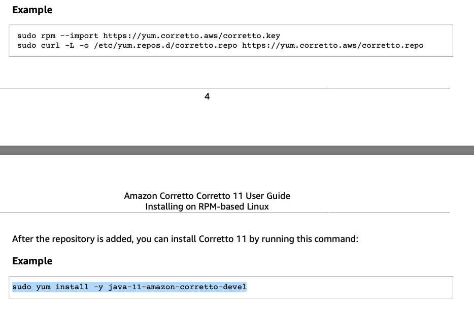

## Travis CI / Coveralls / aws code deploy 구축

> https://jojoldu.tistory.com/275

### Travis

1. travis가입 후 레파지토리 연결

2. `.travis.yml` 파일 생성

   ```yaml
   language: java
   jdk:
     - openjdk11
   
   branches:
     only:
       - master
   
   # Travis CI 서버의 Cache 활성화
   cache:
     directories:
       - '$HOME/.m2/repository'
       - '$HOME/.gradle'
   
   # clean 후 Build (Build시 자동으로 test 수행)
   script: "./gradlew clean build"
   ```

3. Readme.md에 build결과 보이도록 표시하기 

4. [slack notification 연동](https://docs.travis-ci.com/user/notifications/#configuring-slack-notifications)


### 설정

- 접근 권한 문제

  ```yaml
  # 실행전 접근 권한 설정
  before_install:
    - chmod +x gradlew
  ```

- slack notification

  ```yaml
  travis 암호화 기능을 활용하여 key 값보이지 않게하기 / travis 세팅하는 곳에서 key값 정의 해놓기
  ```


#### 발생한 문제

- Application yml 에 설정된 secret key 같은 민간함 정보를 담을 때 git에 올릴수 없고 그로 인해 발생된 travis build 실패를 방지하기 위한 조치

  - ```
    email : ${MAIL_EMAIL} //application.yml
    ```

    - MAIL_EMAIL를 환경변수로 지정하기

  - ```yml
    env:
    	MAIL_EMAIL = $MAIL_EMAIL //.travis.yml
    ```

    - MAIL_EMAIL의 값을 travis 환경변수로 설정
    - 설정된 환경변수는 travis 사이트에서 value값 지정하기


### Coveralls

1. coverall 가입 후 연동

2. `.coveralls.yml`  파일생성 후 repo_token 값 설정하기

3. coverage build를 위한 build.gradle 설정

   ```
   buildscript {
       ...
       dependencies {
           ...
           classpath 'org.kt3k.gradle.plugin:coveralls-gradle-plugin:2.8.2'
       }
   }
   
   apply plugin: 'com.github.kt3k.coveralls'
   apply plugin: 'jacoco'
   
   ...
   
   jacocoTestReport {
       reports {
           xml.enabled = true // coveralls plugin depends on xml format report
           html.enabled = true
       }
   }
   
   ...
   ```

4. `.travis.yml` 빌드 성공 후 실행하도록 설정

   ```yaml
   after_success:
   - ./gradlew jacocoTestReport coveralls
   ```

5. slack notification - incoming webhook 활용하기


### aws code deploy 구축

https://jojoldu.tistory.com/265 참고하기


#### 문제

- please upgrade for ruby... 문제

  => ec2 instance 와 s3 tag 네임 잘 설정하기 + ec2 배포 지역 이름 통일화하기 ex) northeast-a

- Oops, It looks like you tried to write to a bucket that isn't yours or doesn't exist yet. Please create the bucket before trying to write to it. 문제

  => `새 퍼블릭 ACL 및 퍼블릭 객체 업로드 차단`만 체크해제 

- ec2 java 11 설치 (aws docs)

  


