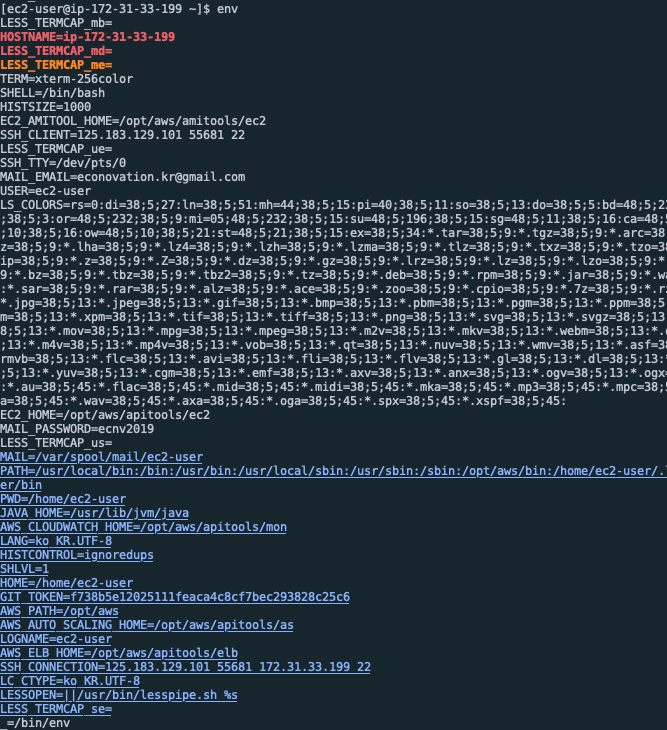
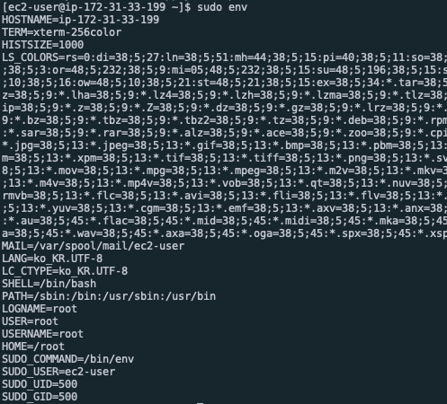

## 스프링 부트 실행시 환경 변수 설정 안되는 문제

### `java jar` 로 실행하면 환경변수가 적용되는 데 `.sh` 를 실행하면 왜 안될까?

#### 원인 분석

- 실행하고자 하는 shell script의 접근 권한
  - chmod를 활용하여 최고 단계의 접근 권한을 줘도 안됨
- `--server.port` 옵션을 붙여서 그러지 않을 까?
  - 없애도 안됨
- 실행하는 스프링 부트의 경로가 절대경로가 아닌 상대경로로 지정하면 어떨까?
  - 안됨.
- sudo를 이용해서 실행하는 데 이것때문일까?
  - O

### 왜 sudo를 이용하면 안될까?

다음은 환경변수 목록과 sudo를 이용한 환경변수 목록이다

sudo를 이용할 경우 환경변수 목록이 현저히 줄어드는 것을 확인 할 수 있다.

그렇다면 왜! 환경변수가 적용 되지 않을 걸까? 

- Linux의 기본 보안 정책 플러그인으로 인해 제한됬기 때문이다

### 해결방법

> https://unix.stackexchange.com/questions/337819/how-to-export-variable-for-use-with-sudo

sudo 를 활용해서 실행할 때 sudo 앞에 환경변수를 설정하고 `-E`옵션을 사용한다

`<Environment Variables>=<value> sudo -E ...`

Ex) `JASYPT_PASSWORD=sprouttsecret sudo -E java -jar $REPOSITORY/jar/$JAR_NAME --server.port=80`

